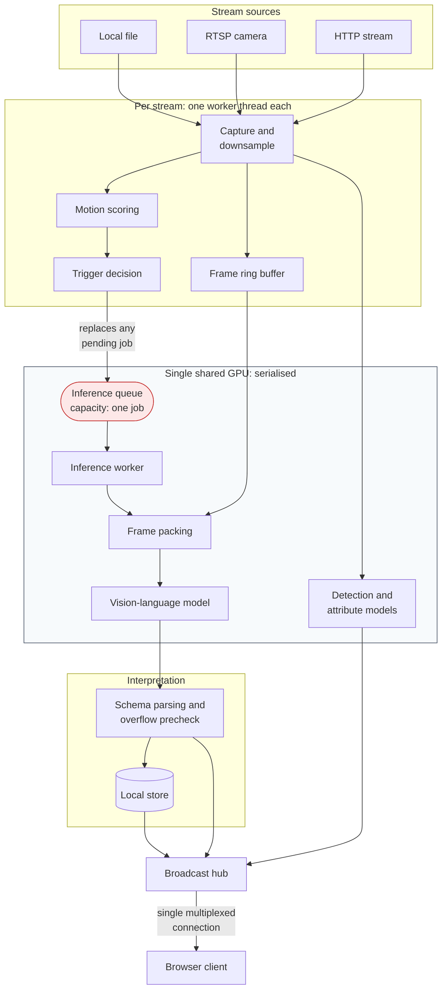

# Real-Time Streaming Video Understanding

[← Portfolio index](../README.md) · [繁體中文版](01-streaming-video-understanding.zh-TW.md)

     

> A self-hosted platform that continuously analyses live and recorded video with a vision-language model, letting the model judge what is happening and whether it is dangerous, with classical computer vision running alongside for the tasks a VLM cannot do fast enough. Employer work: architecture and reasoning only, relative measurements, tools named by class.

## 1. At a glance

| Item | Detail |
|---|---|
| **Type** | Self-hosted real-time video analysis platform, VLM plus classical vision |
| **Role** | Sole author, built during paid employment |
| **Period** | Roughly six weeks of intensive work · 286 commits in 43 days |
| **Scale** | Four-figure backend test count; 31 specifications carrying numeric acceptance criteria |
| **Constraint** | One GPU, many live streams, inference an order of magnitude slower than capture |
| **State** | In service |
| **Source** | Employer's property; not published |

## 2. Tech stack

| Layer | Technology |
|---|---|
| **Backend** | Python, FastAPI, asyncio, embedded transactional store |
| **Frontend** | Vue 3, TypeScript, Vite, component library, build-time type checking |
| **Vision-language inference** | Locally hosted open-weight models, 7–12B class, via a local serving runtime |
| **Classical vision** | OpenVINO (Apache-2.0) inference runtime; detection, attribute recognition and re-identification models |
| **Audio** | Local event classification model; on-demand description by an audio-capable model |
| **Media** | Standard open-source video decoding and stream handling libraries |
| **Infrastructure** | Docker Compose, multi-stage builds, NVIDIA GPU passthrough under WSL2 |
| **Testing** | Python test framework with async support; frontend unit testing restricted to pure logic; injectable inference client for end-to-end tests |

## 3. Architecture

### The layers

**Capture.** One worker thread per stream. It reads frames, downsamples, scores motion, writes to a bounded ring buffer, pushes preview imagery, and decides when a window is worth analysing. It deliberately **never calls the model**: inference latency must never be able to stall frame acquisition, or a camera's connection state becomes coupled to GPU load.

**Scheduling.** A queue with a capacity of exactly one job per stream, feeding a single worker that serialises all GPU access.

**Packing.** Two strategies for presenting several frames to the model (as a sequence of separate images, or composited into one grid image), selectable by configuration.

**Interpretation.** Prompt construction, structured output parsing, and a precheck that rejects a request before dispatch if it would exceed the model's input budget.

**Distribution.** One multiplexed real-time connection per client carrying every message class, discriminated by a type field.

**Parallel pipelines.** Five independent analysis pipelines share the capture thread but are otherwise decoupled: scene understanding by the VLM, person detection with attribute recognition, people-flow counting, zone occupancy, and audio event analysis.

## 4. What was built

| Mechanism | Built with | Problem it solves |
|---|---|---|
| **Replace-on-arrival single-slot queue** | One pending job per stream; a new trigger discards the waiting one | Permanent oversubscription: an unbounded queue drifts minutes behind real time; dropping the newest is backwards for monitoring. Failure mode becomes lower temporal resolution, never staleness |
| **One inference worker, not a pool** | A single task serialising every GPU call | One GPU, one model filling most of VRAM: concurrent requests interleave and both finish later; serialised, latency has one explanation |
| **Model judges, classical vision measures** | Small purpose-built models for detection, attributes, re-ID, tripwires, zones; the VLM for open-ended interpretation | Counting crossings needs video-rate geometry the VLM cannot deliver; open-ended judgement is what small models cannot do |
| **Two frame-packing strategies behind one switch** | Separate images, or one composited grid, selected by configuration | Multi-image support in local runtimes was inconsistent across versions; the grid reduces it to single-image input every runtime handles identically |
| **Capability gates separate from enablement flags** | Environment-level "can this machine run it" vs per-stream "should this stream run it" | One switch conflates a disabled feature with a machine that cannot run it, and the two produce the same state with different fixes |
| **One multiplexed real-time connection** | A single connection per client, message types discriminated by a type field | Reconnection is the hard part and scales with connection count; one connection means one reconnect path and one ordering rule |
| **Injectable inference client** | Composition root accepts a substitute client | Turns "can I unit-test components" into "can I exercise the whole path deterministically"; the suite grew to four figures partly because this was cheap |
| **Licence as an architectural constraint** | Permissively licensed inference toolkit, reasoning recorded in the package manifest | A copyleft dependency in the inference path of a commercial product is legal exposure, not preference |
| **Drop counting exposed on the health endpoint** | Instrumentation on the queue policy | A system quietly discarding most analyses looks identical to one keeping up unless drops are made visible |

## 5. Limitations and what I would do differently

**The system has no authentication.** It was scoped for a trusted network. This is documented rather than hidden, but it is a real limitation and the first thing I would address before any deployment beyond that assumption.

**Single-node by construction.** The scheduling design assumes one GPU in one process. Scaling to several machines is not a configuration change. It needs a different scheduler and a distribution mechanism that does not currently exist.

**Local persistence is convenient and limiting.** An embedded store was correct for a single-node appliance and removed an entire class of deployment complexity. It also makes retention policy, concurrent analytical querying, and horizontal scale harder than they need to be. If snapshot history were to grow significantly, this would be the first thing to change.

**Model dependency is a business risk.** The product's central capability rests on open-weight models that could change licence, degrade, or be withdrawn. The abstraction that allowed the primary model to be swapped mitigates this, but does not remove it.

**I would instrument cold-start explicitly.** The first-activation problem cost a day of debugging in the wrong place. A readiness signal that distinguishes *loaded* from *warm* should have existed before it was needed, not after.

**I would have caught my own bad benchmark sooner.** One comparison in this project ran on synthetic noise rather than real frames, which distorted post-processing cost and produced a wrong conclusion that stood for a while before I corrected it. Noise has no real structure, so the detector emits a flood of low-confidence candidates and the post-processing stage does work it would never do on real input. The rule I took from it: a benchmark's input is part of its methodology, and *it ran and produced numbers* is not evidence that it measured anything.

