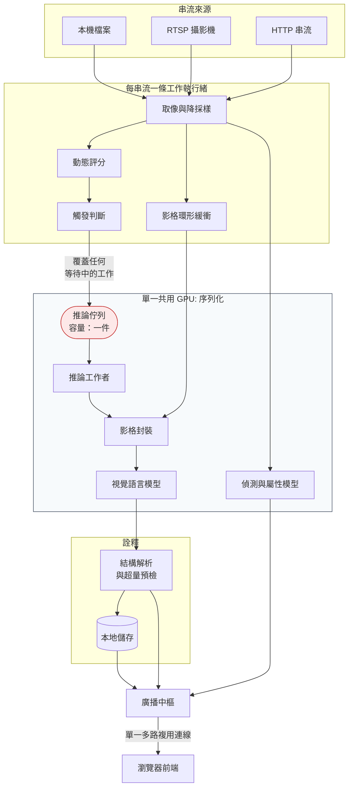

# 即時串流影像理解系統

[← 作品集索引](../README.zh-TW.md) · [English version](01-streaming-video-understanding.md)

     

> 自架平台，以視覺語言模型持續分析即時與錄製影像，讓模型自己判斷現場在發生什麼、危不危險，並讓傳統電腦視覺在旁邊並行處理 VLM 做不夠快的任務。受雇期間的工作：只談架構與推理、只給相對量測、工具以類別稱之。

## 1. 專案綱要

| 項目 | 內容 |
|---|---|
| **類型** | 自架即時影像分析平台，VLM 加傳統電腦視覺 |
| **角色** | 獨力完成，受雇期間 |
| **期間** | 約六週高強度開發 · 43 天 286 個 commit |
| **規模** | 後端測試四位數；31 份帶數值驗收條件的規格 |
| **限制** | 一張 GPU、多路即時串流，推論比擷取慢一個量級 |
| **狀態** | 服役中 |
| **原始碼** | 雇主所有，不公開 |

## 2. 技術棧

| 層 | 技術 |
|---|---|
| **後端** | Python、FastAPI、asyncio、內嵌交易式儲存 |
| **前端** | Vue 3、TypeScript、Vite、元件庫、建置期型別檢查 |
| **視覺語言推論** | 本地託管的開放權重模型，7–12B 級，經本地服務執行環境 |
| **傳統視覺** | OpenVINO（Apache-2.0）推論執行環境；偵測、屬性辨識與重識別模型 |
| **音訊** | 本地事件分類模型；由具音訊能力的模型按需描述 |
| **媒體** | 標準開源影片解碼與串流處理函式庫 |
| **基礎設施** | Docker Compose、多階段建置、WSL2 下的 NVIDIA GPU 直通 |
| **測試** | 支援 async 的 Python 測試框架；前端單元測試限於純邏輯；可注入的推論客戶端供端到端測試 |

## 3. 架構

### 各層

**取像。** 每串流一條工作執行緒，負責讀影格、降採樣、評估動態、寫入有界環形緩衝、推送預覽、並判斷哪一段視窗值得分析。它刻意**從不呼叫模型**：推論延遲絕不能有機會卡住影格取得，否則攝影機的連線狀態就跟 GPU 負載綁在一起了。

**排程。** 每串流容量恰好為一的佇列，餵給單一工作者，由它序列化所有 GPU 存取。

**封裝。** 兩種把多張影格呈現給模型的策略（當成一系列獨立影像，或合成為一張網格圖），由設定切換。

**詮釋。** 建構 prompt、解析結構化輸出，以及一道在送出前就攔下超出模型輸入預算的預檢。

**分發。** 每個前端一條多路複用的即時連線，承載所有訊息類別，靠一個型別欄位區分。

**並行管線。** 五條獨立的分析管線共用取像執行緒，其餘完全解耦：VLM 場景理解、人物偵測與屬性辨識、人流計數、區域佔用、音訊事件分析。

## 4. 做了哪些事

| 做法 | 用什麼做 | 解決什麼問題 |
|---|---|---|
| **到達即取代的單槽佇列** | 每路串流一個待處理工作；新觸發直接丟棄舊的 | 長期超載下，無界佇列會落後即時畫面好幾分鐘；丟最新的對監控來說方向相反。失效模式變成「時間解析度降低」，永不「過時」 |
| **單一推論 worker，不用 pool** | 一個任務序列化所有 GPU 呼叫 | 一張 GPU、模型佔滿多數 VRAM：並行請求會交錯，兩邊都更慢；序列化後延遲只有一個解釋 |
| **模型判斷、傳統視覺量測** | 偵測、屬性、重識別、絆線、區域用小模型；VLM 負責開放式解讀 | 數穿越需要影格級幾何，VLM 差好幾個數量級；開放式判斷則是小模型做不到的 |
| **兩種影格打包策略共用一個開關** | 分開送圖或合成一張網格圖，設定即可切換 | 本地執行環境對多圖輸入的支援跨版本不一致；網格把問題化為每個環境都一致處理的單圖 |
| **能力閘與啟用旗標分開** | 環境層「這台機器能不能跑」vs 逐串流「這路要不要跑」 | 單一開關會把「使用者關掉」與「機器跑不了」混成同一狀態，解法卻不同 |
| **單一多工即時連線** | 每個客戶端一條連線，訊息以型別欄位區分 | 重連是即時客戶端最難的部分且隨連線數放大；一條連線只有一條重連路徑、一套排序規則 |
| **可注入的推論客戶端** | Composition root 接受替代客戶端 | 把「能不能單元測試元件」變成「能不能確定性地走完整條路徑」；測試數量會長到四位數，有一部分原因就是這很便宜 |
| **授權當成架構限制** | 寬鬆授權的推論工具鏈，理由記在套件清單裡 | 商業產品的推論路徑上有 copyleft 依賴是法律風險，不是偏好 |
| **丟棄次數暴露在健康端點** | 佇列策略上的量測 | 一個悄悄丟掉多數分析的系統，不把丟棄弄成可見就跟跟得上的系統一模一樣 |

## 5. 限制，以及我會怎麼改

**系統沒有身分驗證。** 它的設定範圍是可信網路。這件事被記錄而非隱藏，但它是真實的限制，也是我在任何超出該假設的部署之前第一件要處理的事。

**結構上就是單節點。** 排程設計假設一個行程裡有一張 GPU。擴展到多台機器不是改設定，而是需要一個不同的排程器，以及一套目前不存在的分發機制。

**本地持久化既方便也受限。** 嵌入式儲存對單節點設備是正確選擇，消除了一整類部署複雜度。它同時也讓保留策略、併發分析查詢與水平擴展比必要的更難。若快照歷史規模顯著成長，這會是第一個要改的東西。

**模型相依是商業風險。** 產品的核心能力建立在開放權重模型上，而這些模型可能改授權、退化、或被下架。那層讓主模型可以被抽換的抽象降低了風險，但沒有消除它。

**我會把冷啟動明確儀表化。** 那個首次啟動問題讓我在錯誤的地方耗掉了一天。一個區分「已載入」與「已暖機」的就緒訊號，應該在被需要之前就存在，而不是之後。

**我應該更早抓到自己那個壞掉的 benchmark。** 這個專案裡有一次比較跑在合成雜訊而非真實影格上，扭曲了後處理成本，產生了一個錯誤結論，而它成立了一段時間才被我修正。雜訊沒有真實結構，所以偵測器會吐出大量低信心候選框，後處理階段做了它在真實輸入上永遠不會做的工。我從中得到的規則是：**一個 benchmark 的輸入是它方法論的一部分**，而「它跑完了而且產出了數字」不構成「它量到了任何東西」的證據。

