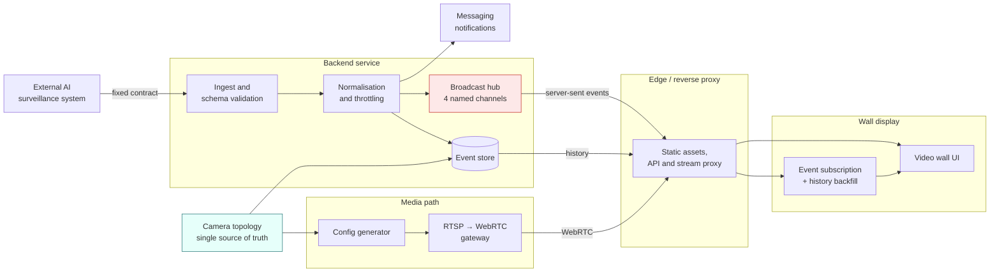

# Real-Time AI Surveillance Video Wall

[← Portfolio index](../README.md) · [繁體中文版](02-realtime-video-wall.zh-TW.md)

     

> A large-screen operations wall driven by live data. An external AI surveillance system pushes detection events over a contract I could not change; this system validates and persists them, fans them out to every connected display in real time, and renders a multi-camera live video wall alongside. Employer work: architecture and reasoning only.

## 1. At a glance

| Item | Detail |
|---|---|
| **Type** | Real-time operations display, event ingestion and fan-out, live video wall |
| **Role** | Sole author, built during paid employment |
| **Period** | Roughly ten weeks · 10 tagged releases |
| **Scale** | Nine cameras; one process serving every connected display |
| **Constraint** | An upstream contract with exactly one upload URL; a target with no registry access |
| **State** | Delivered as offline ARM64 bundles |
| **Source** | Employer's property; not published |

## 2. Tech stack

| Layer | Technology |
|---|---|
| **Backend** | TypeScript, Node.js, Fastify, schema validation library, typed query builder |
| **Real-time** | Server-sent events, implemented at the response level, four named channels on one connection |
| **Data** | PostgreSQL, with an in-memory store implementation used in tests |
| **Frontend** | Vue 3, Pinia, Vite, hand-written CSS transitions, no animation library |
| **Media** | RTSP-to-WebRTC gateway, configuration generated from one topology file |
| **Infrastructure** | Docker Compose, reverse proxy for static assets and API, offline ARM64 bundling with cross-architecture emulation |
| **Testing** | Unit testing on both tiers, component testing with a DOM implementation, checked-in HTTP contract collection |

## 3. Architecture

### The layers

**Ingest.** A single documented endpoint receives everything the upstream system produces. Schema validation happens at the boundary; nothing unvalidated reaches the store.

**Normalisation and throttling.** Upstream output is shaped for a machine consumer, not a display. This layer applies de-duplication and timing policy.

**Persistence and broadcast.** Events are stored for history and simultaneously fanned out over four named real-time channels.

**Media.** Camera RTSP streams are converted to a browser-playable transport by a dedicated gateway, whose configuration is generated from the same topology file the rest of the system reads.

**Client.** One subscription per display, with automatic reconnection and history backfill.

## 4. What was built

| Mechanism | Built with | Problem it solves |
|---|---|---|
| **One endpoint, two payload shapes** | Route on the presence of a correlation field | The upstream contract has one upload URL carrying two logically distinct things, and a contract change was not possible within the timeline |
| **Server-sent events, not WebSocket** | One-directional HTTP stream | The wall listens and never speaks; SSE passes through proxies untouched and reconnection is in the browser, not in my code |
| **Four named channels, isolated writes** | Events, telemetry, ticker, query results on one subscription; every write guarded | One process serves every display, and one dead client's socket write would otherwise terminate the process for all of them |
| **Backfill on reconnect** | Client detects errored→open and fetches the gap | Reconnection restores the stream, not the events missed while disconnected; without backfill a 30-second blip is a permanent hole |
| **Two throttles as pure functions** | Timing policies with injected time, no I/O | Timing logic entangled with database and network calls is nearly untestable; isolated, both are exhaustively testable in milliseconds |
| **Telemetry rides on events** | Hardware and inference metrics embedded in each detection event | Telemetry is about the inference that produced the event; a separate stream means reconstructing that relationship by timestamp |
| **Simulated panel labels itself** | Fallback telemetry visibly marked as simulated | Plausible invented numbers displayed as live are the failure to prevent |
| **Demonstration mode with no backend** | Build-time flag, fully client-side simulation excluded from the production bundle | The scenario is a venue where the network or upstream has failed an hour before a demonstration |
| **Replay data tagged on the wire** | Explicit request flag, cannot create unknown cameras in live mode, badged in the UI | An operator must always be able to tell whether what they see is real |
| **One topology file, everything generated** | Gateway config, database seed and UI all derived from one file | Duplicated camera naming fails as a tile showing the wrong camera, not as a crash |
| **Deployment is a file** | Versioned self-contained archives built cross-architecture; fixed composition project name | No registry on the target; a derived project name would double the running stack on every upgrade |

## 5. Limitations and what I would do differently

**Broadcast is single-process.** Every display is served by one process holding every connection. This is correct for a venue-scale deployment and wrong for anything larger; horizontal scale needs a shared distribution layer that does not exist here.

**No authentication on ingest beyond network placement.** Appropriate for an isolated deployment, insufficient for anything else, and the first thing I would change if the topology opened up.

**Query results are deliberately not persisted.** They are session-scoped and vanish on reload. That was the right call for a wall display and it does mean there is no record of what was asked. If this became an operator tool rather than a display, it would need to change.

**Simulation mode is a maintenance liability.** It has earned its place, but it is a second path that can drift from the real one, and only discipline keeps them aligned.

**I would build the media path first next time.** Browser video from IP cameras consumed disproportionate time relative to its share of the specification, and both black-video faults were environmental rather than logical. In a system with a media component, that component should be proven on the *actual target hardware and browser* at the start, because it is the part least likely to behave as documented.

**I would instrument the transport earlier.** Both video faults were diagnosed from transport statistics. Had a diagnostic view of those statistics existed from the beginning, both would have been minutes rather than hours.

