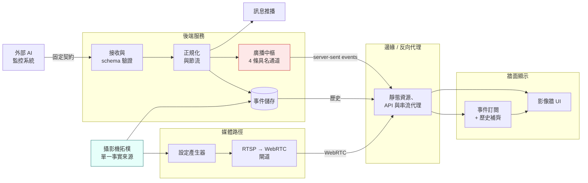

# 即時 AI 監控影像牆

[← 作品集索引](../README.zh-TW.md) · [English version](02-realtime-video-wall.md)

     

> 真實資料驅動的大螢幕維運牆。外部 AI 監控系統依照一份我無權更動的契約推送偵測事件；本系統驗證並持久化它們、即時扇出到每一面連線中的顯示，並在旁邊渲染多路即時影像。受雇期間的工作：只談架構與推理。

## 1. 專案綱要

| 項目 | 內容 |
|---|---|
| **類型** | 即時維運顯示：事件擷取與扇出、即時影像牆 |
| **角色** | 獨力完成，受雇期間 |
| **期間** | 約十週 · 10 個標記版本 |
| **規模** | 九路攝影機；一個行程服務所有連線中的顯示端 |
| **限制** | 上游契約只有一個上傳 URL；目標機器沒有 registry 存取 |
| **狀態** | 以離線 ARM64 封裝交付 |
| **原始碼** | 雇主所有，不公開 |

## 2. 技術棧

| 層 | 技術 |
|---|---|
| **後端** | TypeScript、Node.js、Fastify、schema 驗證函式庫、型別化查詢建構器 |
| **即時** | Server-sent events，實作在回應層；一條連線四個具名頻道 |
| **資料** | PostgreSQL；測試用記憶體內儲存實作 |
| **前端** | Vue 3、Pinia、Vite、手寫 CSS 轉場、無動畫函式庫 |
| **媒體** | RTSP 轉 WebRTC 閘道，設定由單一拓樸檔產生 |
| **基礎設施** | Docker Compose、靜態資源與 API 的反向代理、以跨架構模擬產出的離線 ARM64 封裝 |
| **測試** | 兩層皆有單元測試、以 DOM 實作做元件測試、簽入版控的 HTTP 契約集合 |

## 3. 架構

### 各層

**接收。** 單一份有文件的端點接收上游產出的一切。schema 驗證發生在邊界；未經驗證的資料不會進入儲存。

**正規化與節流。** 上游輸出的形狀是為機器消費者設計的，不是為顯示設計的。這一層套用去重與時序政策。

**持久化與廣播。** 事件被存下來供歷史查詢，同時透過四條具名即時通道扇出。

**媒體。** 攝影機的 RTSP 串流由專用閘道轉成瀏覽器可播的傳輸，而該閘道的設定，是從系統其他部分讀的同一份拓樸檔產生的。

**前端。** 每個顯示端一條訂閱，具備自動重連與歷史補齊。

## 4. 做了哪些事

| 做法 | 用什麼做 | 解決什麼問題 |
|---|---|---|
| **一個端點、兩種 payload** | 以關聯欄位是否存在來路由 | 上游契約只有一個上傳 URL，卻承載兩種邏輯上不同的東西，而契約無法更動 |
| **SSE 而非 WebSocket** | 單向 HTTP 串流 | 牆只聽不說；SSE 穿過代理不需特殊設定，而且重連是瀏覽器內建的，不是我寫的 |
| **四個具名頻道、寫入隔離** | 事件、遙測、跑馬燈、查詢結果共用一條訂閱；每次寫入各自防護 | 一個行程服務所有顯示，一個已死客戶端的 socket 寫入若不防護，會讓所有人的行程一起終止 |
| **重連後回補** | 客戶端偵測 errored→open 並抓取斷線期間的歷史 | 重連恢復的是串流不是漏掉的事件；沒有回補，30 秒的網路抖動就是永久的洞 |
| **兩個節流器寫成純函式** | 時間注入、無 I/O 的時序策略 | 與資料庫、網路糾纏的時序邏輯幾乎無法測；隔離後兩者都能在毫秒內窮舉測試 |
| **遙測搭在事件上** | 硬體與推論指標內嵌在每個偵測事件裡 | 遙測是關於產生該事件的那次推論；分開的串流意味著靠時間戳重建這個關係 |
| **模擬面板會自我標示** | 備援遙測明確標成模擬 | 把看似合理的虛構數字當即時顯示，正是要防的失效 |
| **無後端的展示模式** | 建置期旗標；純客戶端模擬，不進生產 bundle | 情境是展示前一小時網路或上游壞掉的場地 |
| **重播資料在線路上加標** | 明確的請求旗標、live 模式下不得新建未知攝影機、UI 上加徽章 | 操作員必須永遠分得出眼前的東西是不是真的 |
| **單一拓樸檔、其餘全生成** | 閘道設定、資料庫種子、UI 全由一檔衍生 | 重複命名攝影機的失效不是崩潰，是某個格子顯示了錯的攝影機 |
| **部署是一個檔案** | 版本化、自含的封裝，跨架構建置；固定的 compose 專案名稱 | 目標沒有 registry；由目錄衍生的專案名會讓每次升級多跑一套 |

## 5. 限制，以及我會怎麼改

**廣播是單行程的。** 每一面顯示都由一個持有所有連線的行程服務。這對場館級部署是正確的，對更大規模就是錯的；水平擴展需要一個這裡沒有的共用分發層。

**接收端除了網路位置之外沒有身分驗證。** 對隔離部署恰當，對其他任何情況都不足，而這是拓樸一旦打開我第一個要改的東西。

**查詢結果刻意不持久化。** 它們是 session 範圍的，重新載入就消失。對一面顯示牆而言這是對的決定，但它也意味著沒有任何「誰問過什麼」的紀錄。若這變成維運人員的工具而非顯示牆，就必須改。

**模擬模式是維護負債。** 它掙得了自己的位置，但它是第二條可能與真實路徑漂移的路徑，而維持一致只能靠紀律。

**下次我會先做媒體路徑。** 瀏覽器播 IP 攝影機影像，消耗的時間相對於它在規格中的比重嚴重不成比例，而兩次黑畫面故障都是環境問題而非邏輯問題。在有媒體元件的系統裡，該元件應該在一開始就在**實際目標硬體與瀏覽器**上驗證，因為它是最不可能照文件行為的那一塊。

**我會更早把傳輸層儀表化。** 兩次影像故障都是靠傳輸統計診斷出來的。如果那些統計的診斷視圖從一開始就存在，兩次都會是分鐘級而非小時級。

