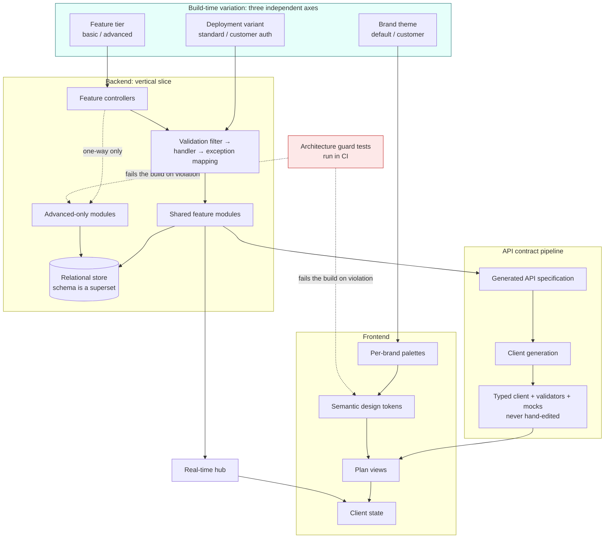

# Multi-Tenant Collaborative Planning Platform

[← Portfolio index](../README.md) · [繁體中文版](03-collaborative-planning-platform.zh-TW.md)

      

> An enterprise task and plan management product shipping in multiple commercial configurations (two feature tiers, multiple brands, multiple authentication models) from a single codebase, with real-time multi-user collaboration throughout. **The one team project in this portfolio**: the folded *My contribution, stated plainly* section states which architecture is mine and which is my colleagues'.

## 1. At a glance

| Item | Detail |
|---|---|
| **Type** | Enterprise SaaS, multi-tenant, multi-brand, two feature tiers |
| **Role** | Largest of four contributors, **116 of 236 commits**; backend, frontend and deployment. Not a solo project |
| **Period** | Roughly six months |
| **Scale** | Three independent build-time variation axes; a build matrix rather than a build |
| **Attribution** | Tier gates, module isolation and pagination guard tests are colleagues' work; the colour scan, token completeness check and my feature's six guard tests are mine |
| **State** | In development |
| **Source** | Employer's property; not published |

## 2. Tech stack

| Layer | Technology |
|---|---|
| **Backend** | C#, .NET, ASP.NET Core Web API, mediator-based vertical slice, declarative validation, ORM with code-first migrations |
| **Data** | PostgreSQL, object storage for attachments |
| **Real-time** | Managed bidirectional hub with typed event payloads |
| **Frontend** | TypeScript, Vue 3, Nuxt, client state library, utility-first CSS with semantic token layer, headless component library, charting library |
| **Contract** | Generated API specification with custom transformations; generated typed client, validators and mocks |
| **Observability** | Structured logging to console and a central cluster, with a file fallback for offline sites |
| **Infrastructure** | Containers, CI build matrix, orchestration chart for cloud deployment (colleagues' work), and a separate single-server offline deployment path (mine) |
| **Testing** | Backend integration tests against a real containerised database; frontend unit and component tests; reflection-based architecture guard tests |

## 3. Architecture

## 4. What was built

| Mechanism | Built with | Problem it solves |
|---|---|---|
| **Three orthogonal variation axes** | Feature tier, brand, deployment variant as independent build-time selections | A fork per customer is the fastest-feeling and most expensive option; runtime tenancy ships the paid code to everyone. A basic build does not contain the advanced code at all |
| **Two-layer design tokens** | Components reference semantic tokens; a per-brand palette supplies values; status and chart colours invariant | Red must mean danger in every brand; a brand whose identity colour is red must not turn its error states into its primary colour |
| **Architecture rules as tests** | Reflection over compiled assemblies and source-tree scans that fail CI | A documented rule is enforced by whoever remembers it; a rule that fails CI is enforced always, including against its author |
| **Reverse-whitelist colour scan** *(mine)* | Recursive scan of everything under the UI directories with a small justified exception list | A literal colour in one component survives every review and ships a rebranded build with the wrong colour in one corner |
| **Gated endpoints return not found** | Advanced endpoints on a basic deployment respond as though absent | Forbidden is a disclosure: enumerated, it reveals the complete shape of the paid feature set to those who did not buy it |
| **Generated API client** | Formal specification from typed controller results; client, validators and mocks generated, never hand-edited | A hand-written client drifts and the drift is found at runtime by a user; generated mocks cannot pass against a contract the server does not honour |
| **Four scopes of state synchronisation** | Within tab / across tabs (ephemeral only) / across machines / durable (write, then publish) | Without a model every feature re-decides ad hoc, and the bugs are a change visible in one tab and not another |
| **Exhaustive event matching** | Real-time handlers as exhaustive matches, not conditional chains | Adding an event type without handling it fails to compile instead of being silently ignored |
| **One shared schema, strict superset** | Identical schema across tiers; advanced structures present but never written on basic | Divergent schemas make a tier upgrade a data-migration project; one schema makes it a redeployment |

## 5. Limitations and what I would do differently

**Build-time variation is not runtime variation.** Three axes multiply into a build matrix, and every axis added multiplies it again. This is the right trade for a small number of dimensions with a hard isolation requirement, and it would not scale to many. A fourth axis would be the point to reconsider.

**The generated client tree is large in version control.** Committing generated output makes builds reproducible and reviews noisy. I would keep the decision and invest more in making those diffs easy to skim.

**Cross-boundary calls resolve indirectly**, which is the concession the one-way dependency rule extracts. It is correct and it is less obvious than a direct call; it needs a comment at every site, and did not always have one.

**The tag scheme is not semantic.** Release markers on this project are dated rather than versioned, which makes *which build is this* harder to answer than it should be. The video wall project in this portfolio does this properly, and the contrast is instructive: that was the later project, and the practice improved.

**I would have introduced the guard tests earlier.** The two I wrote were both written *after* the class of bug they prevent had already occurred. That is the normal way these things happen, but the tier guards written by a colleague at the start of the project are the better model: the constraint was encoded when the boundary was drawn, not after it was first crossed.

