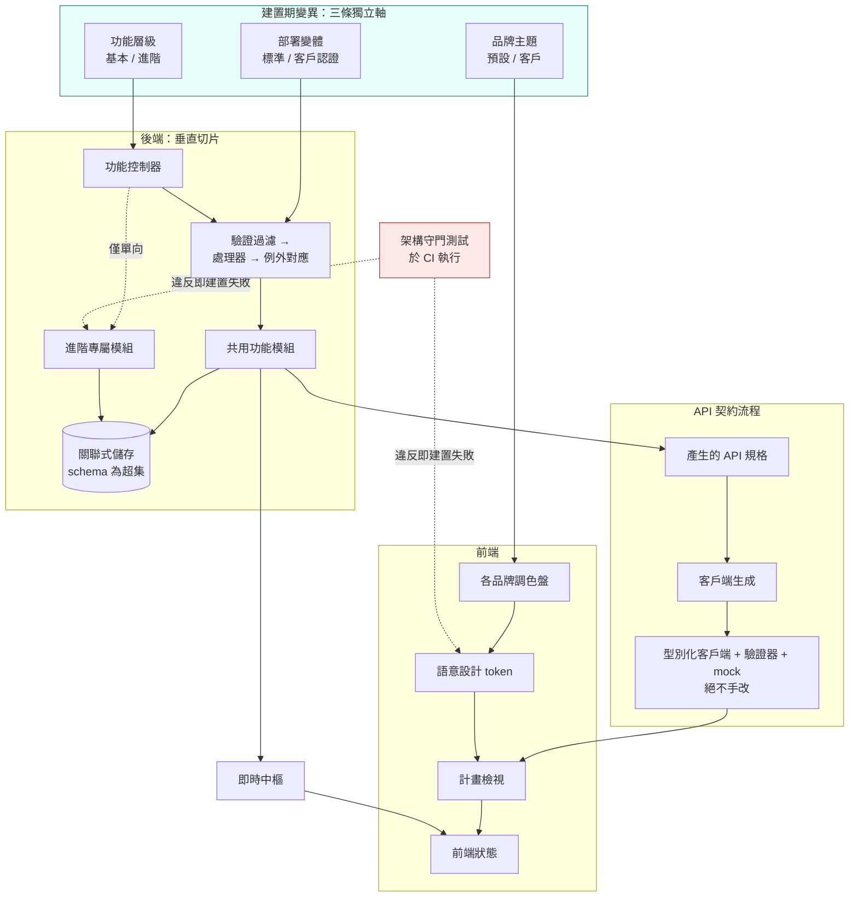

# 多租戶協作規劃平台

[← 作品集索引](../README.zh-TW.md) · [English version](03-collaborative-planning-platform.md)

      

> 企業級任務與計畫管理產品，從單一 codebase 出貨成多種商業組態（兩種功能層級、多品牌、多種認證模式）且全程支援即時多人協作。**這是作品集裡唯一的團隊專案**：摺疊區的「我的貢獻，直說」明確說明哪些架構是我的、哪些是同事的。

## 1. 專案綱要

| 項目 | 內容 |
|---|---|
| **類型** | 企業 SaaS，多租戶、多品牌、兩種功能層級 |
| **角色** | 四位貢獻者中貢獻最多的一位，**236 個 commit 中的 116 個**；橫跨後端、前端與部署。不是獨力專案 |
| **期間** | 約六個月 |
| **規模** | 三條互相獨立的建置期變異軸；是一個建置矩陣而不是一次建置 |
| **歸屬** | 層級閘、模組隔離與分頁的守門測試是同事的；顏色掃描、token 完整性檢查與我功能的六個守門測試是我的 |
| **狀態** | 開發中 |
| **原始碼** | 雇主所有，不公開 |

## 2. 技術棧

| 層 | 技術 |
|---|---|
| **後端** | C#、.NET、ASP.NET Core Web API、mediator 式垂直切片、宣告式驗證、code-first 遷移的 ORM |
| **資料** | PostgreSQL、附件用物件儲存 |
| **即時** | 受管的雙向 hub，事件 payload 帶型別 |
| **前端** | TypeScript、Vue 3、Nuxt、客戶端狀態庫、utility-first CSS 加語意 token 層、headless 元件庫、圖表庫 |
| **契約** | 帶自訂轉換的生成 API 規格；生成的型別化客戶端、驗證器與 mock |
| **觀測** | 結構化日誌到 console 與中央叢集，離線站點有檔案備援 |
| **基礎設施** | 容器、CI 建置矩陣、雲端部署用的編排 chart（同事的工作）以及另一條單機離線部署路徑（我的） |
| **測試** | 後端整合測試打真實容器化資料庫；前端單元與元件測試；反射式架構守門測試 |

## 3. 架構

## 4. 做了哪些事

| 做法 | 用什麼做 | 解決什麼問題 |
|---|---|---|
| **三條互相獨立的變異軸** | 功能層級、品牌、部署變體是各自獨立的建置期選項 | 每客戶一個 fork 感覺最快、實際最貴；執行期租戶會把付費程式碼出貨給所有人。基本版建置裡根本不含進階程式碼 |
| **兩層設計 token** | 元件只引用語意 token；逐品牌調色檔供值；狀態與圖表色不隨品牌變 | 紅色在每個品牌都必須代表危險；品牌識別色是紅的品牌，不能因此把錯誤狀態變成主色 |
| **架構規則寫成測試** | 對編譯後組件做反射、掃原始碼樹，違規就讓 CI 失敗 | 寫在文件裡的規則靠記得的人執行；會讓 CI 失敗的規則永遠執行，包含對寫規則的人 |
| **反向白名單顏色掃描**（我的） | 遞迴掃 UI 目錄下所有檔案，只留一份逐條說明的例外清單 | 一個元件裡的一個字面色值撐得過每次 review，然後在換品牌後的建置的某個角落出現錯的顏色 |
| **被閘控的端點回 not found** | 基本版部署上，進階端點表現得像不存在 | forbidden 是一種揭露：列舉一遍，沒買的人就能看出整套付費功能的形狀 |
| **API 客戶端是生成的** | 由型別化 controller 結果產生正式規格；客戶端、驗證器、mock 全部生成、從不手改 | 手寫的客戶端會漂移，而漂移由使用者在執行期發現；生成的 mock 不可能對著伺服器不遵守的契約通過 |
| **四種狀態同步範圍** | 單分頁 / 跨分頁（只限暫態 UI）/ 跨機器 / 跨機器且持久（先寫再發） | 沒有模型，每個新功能都各自臨場決定，而 bug 是一個分頁有變、另一個沒有 |
| **窮舉式事件比對** | 即時事件處理寫成窮舉 match，不用條件鏈 | 新增事件型別而沒處理，會編譯失敗，而不是執行期被無聲略過 |
| **單一共用 schema，嚴格超集** | 跨層級 schema 一致；進階結構在基本版存在但永不寫入 | schema 分歧會讓升級層級變成資料遷移專案；單一 schema 讓它只是重新部署 |

## 5. 限制，以及我會怎麼改

**建置期變異不是執行期變異。** 三條軸相乘成一個建置矩陣，每多一條軸就再乘一次。對「少數幾個維度 + 硬性隔離要求」而言這是正確取捨，而它無法擴展到很多維度。第四條軸出現時就是重新考慮的時機。

**生成的客戶端樹在版控裡很大。** 把生成產物 commit 進去讓建置可重現，也讓審查變吵。我會保留這個決定，並多投資讓那些 diff 容易略讀。

**跨界呼叫以間接方式解析**，這是單向相依規則索取的讓步。它是正確的，而且比直接呼叫更不明顯；每個呼叫點都需要一段註解，而它們並非總是有。

**標記方案不是語意化的。** 這個專案的發行標記是日期式而非版本式，使得「這是哪一份建置」比它應該的更難回答。這個作品集裡的影像牆專案做對了這件事，而這個對比很有啟發性：那是比較晚的專案，實踐進步了。

**我應該更早引入守門測試。** 我寫的那兩個，都是在它們所防止的那類 bug **已經發生之後**才寫的。事情通常就是這樣發生的，但同事在專案初期寫的那些層級守門測試是更好的模型：約束在邊界被劃下時就編碼進去，而不是在它第一次被跨越之後。

