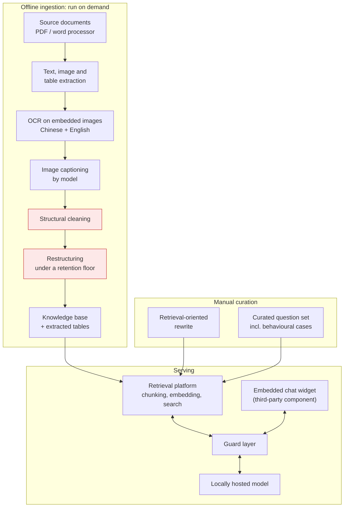

# RAG Customer-Support Assistant

[← Portfolio index](../README.md) · [繁體中文版](04-rag-support-assistant.zh-TW.md)

    

> A retrieval-augmented assistant for end-user support questions about a domain-specific SaaS product: an offline document-ingestion pipeline, a curated knowledge base, a locally hosted model, and a guard layer in front of it. **Prototype and evaluation work, not a shipped product.** The ingestion stage is the interesting engineering.

## 1. At a glance

| Item | Detail |
|---|---|
| **Type** | RAG prototype: ingestion pipeline, knowledge base, local model, guard layer |
| **Role** | Sole author, R&D during paid employment |
| **Period** | Roughly two months |
| **Scale** | 1,461-line ingestion pipeline; six model families × four quantisation strategies × five serving runtimes × two operating systems evaluated |
| **Finding** | It is a document-cleaning problem before it is a retrieval problem, and harder in Chinese, where no whitespace marks where a sentence was broken |
| **State** | Prototype, not shipped; guard layer implemented with several protections left disabled; **no latency, throughput or answer-quality figures were recorded** |
| **Source** | Employer's property; not published |

## 2. Tech stack

| Layer | Technology |
|---|---|
| **Ingestion** | Python; PDF and word-processor extraction libraries; OCR configured for Traditional Chinese and English; table extraction; document conversion tooling |
| **Restructuring** | A hosted model, or any locally served compatible endpoint, selectable by configuration |
| **Serving** | Self-hosted open-weight models, 1–12B class, evaluated across four quantisation strategies and five serving runtimes on two operating systems |
| **Retrieval** | An open-source retrieval platform handling chunking, embedding and search; multilingual embedding model |
| **Guard layer** | Python, asynchronous web framework, streaming reconstruction; presents the same interface as the model server |
| **Client** | A third-party embeddable chat widget, integrated and configured, **not my code** |

## 3. Architecture

The two highlighted stages are the substance of the project. Everything else is assembly.

## 4. What was built

| Mechanism | Built with | Problem it solves |
|---|---|---|
| **Deterministic cleaning before any model** | Control-character removal, whitespace collapse, page-number stripping, frequency-based boilerplate detection | A model handed noisy input spends capacity on the noise and incorporates page numbers mid-sentence, silently |
| **Chinese line-break repair** | Merge lines lacking terminal punctuation; exclude headings, list items, table rows and code fences | Traditional Chinese has no letter case and no inter-word whitespace, so the English continuation heuristic does not exist; a naive merge destroys structure invisibly |
| **Restructuring under a retention floor** | Model instructed never to summarise, held to a minimum retained length, required to self-report coverage | Summarisation is the default behaviour of an instruction-tuned model and it deletes exactly the awkward specifics support answers depend on |
| **Two restructuring variants kept** | Reorganising variant, and a strict variant adding an overview layer over verbatim text | Reorganised text retrieves better; verbatim text is trustworthy. Both built so the comparison could be made on real behaviour (it was not concluded, see §5) |
| **Knowledge base rewritten for retrieval** | Narrative prose into self-contained question-and-answer units; section count roughly tripled at near-constant length | Retrieval lands mid-document with no surrounding context; a well-written human document is therefore badly structured for it |
| **Behavioural entries in the corpus** | Identity, off-topic and small-talk answers stored as retrievable content | Puts the answer where it is inspectable, editable and version-controlled by a non-engineer, rather than in the system prompt |
| **Guard layer with the model server's interface** | Shared-secret auth, scope classification, response filtering, in a separate process | A system prompt is guidance the model can be talked out of; a proxy is a control it cannot reach. Same interface means removable without a client change |
| **Feasibility-first model evaluation** | Breadth across families, quantisations, runtimes and operating systems | With a fixed memory budget the feasible set is unknown until tested; two of four base models could not load un-quantised |

## 5. Limitations and what I would do differently

This project is the weakest in the portfolio, and the specifics are more useful than a general disclaimer.

**It was never measured.** No answer quality evaluation, no retrieval precision measurement, no latency figures. The two restructuring philosophies were built specifically to be compared, and the comparison was never formally run. The most interesting question the project raised is the one it did not answer.

**The guard layer was left disabled.** Designed, implemented, then switched off. A protection that is off is not a protection, and describing it as one would be dishonest.

**It was never put in front of users.** No deployment, no usage, no feedback. Every judgement about whether the approach works is therefore theoretical.

**Engineering hygiene was poor.** One commit. A dependency manifest declaring a fraction of what the code imports. A credential in source. Dead code from a refactor. No automated tests anywhere. The contrast with the projects that followed is stark, and it is not a coincidence: it is what happens without the specification-first, test-first discipline I adopted afterwards.

**What I would do differently, concretely:**

1. **Build an evaluation set before building the pipeline.** Thirty real questions with known-correct answers, run after every ingestion change. Without it, every pipeline decision is aesthetic. This is the single change that would have made the project succeed or fail *knowably*.
2. **Decide the restructuring question with data.** Both variants existed; only a test set was missing.
3. **Enable the guard layer or remove it.** Half-enabled security is worse than none, because it looks like protection.
4. **Treat the corpus as the product.** Most of the value created here was the knowledge-base rewrite and the curated question set: the *content*, not the code. I under-invested there relative to infrastructure, which is the common failure mode of an engineer approaching a RAG problem.

**What it gave me.** Local model serving, memory-bounded model selection, grounded prompting with refusal behaviour, and document processing as a first-class problem, all of which reappear, better executed, in the projects built afterwards. The habit of asking *what did you actually measure* was formed by noticing its absence here.

