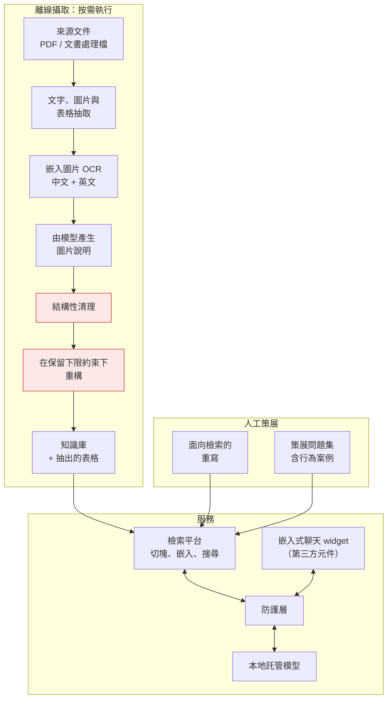

# RAG 客服助理

[← 作品集索引](../README.zh-TW.md) · [English version](04-rag-support-assistant.md)

    

> 檢索增強助理，回答某領域專用 SaaS 產品的使用者支援問題：離線文件攝取管線、經策展的知識庫、本地託管模型，以及一層前置防護。**原型與評估階段的工作，不是已出貨的產品。** 攝取階段是其中有意思的工程。

## 1. 專案綱要

| 項目 | 內容 |
|---|---|
| **類型** | RAG 原型：攝取管線、知識庫、本地模型、防護層 |
| **角色** | 獨力完成，受雇期間的研發 |
| **期間** | 約兩個月 |
| **規模** | 1,461 行攝取管線；評估六個模型家族 × 四種量化策略 × 五個服務執行環境 × 兩個作業系統 |
| **發現** | 它在成為檢索問題之前先是文件清理問題，而在中文裡更難，因為沒有空白標示句子在哪被切斷 |
| **狀態** | 原型、未出貨；防護層已實作但數項保護留在關閉狀態；**沒有記錄任何延遲、吞吐或回答品質數字** |
| **原始碼** | 雇主所有，不公開 |

## 2. 技術棧

| 層 | 技術 |
|---|---|
| **攝取** | Python；PDF 與文書處理格式抽取函式庫；設定為繁體中文與英文的 OCR；表格抽取；文件轉換工具 |
| **重構** | 託管模型，或任何本地服務的相容端點，由設定選擇 |
| **服務** | 自架開放權重模型，1–12B 級，跨四種量化策略、五個服務執行環境、兩個作業系統評估 |
| **檢索** | 處理切塊、嵌入與搜尋的開源檢索平台；多語言嵌入模型 |
| **防護層** | Python、非同步 web 框架、串流重組；對外呈現與模型伺服器相同的介面 |
| **客戶端** | 第三方可嵌入聊天元件，整合與設定，**不是我的程式碼** |

## 3. 架構

兩個標紅的階段是這個專案的實質內容。其餘是組裝。

## 4. 做了哪些事

| 做法 | 用什麼做 | 解決什麼問題 |
|---|---|---|
| **任何模型看到文字之前先做確定性清理** | 移除控制字元、收斂空白、去頁碼、以出現頻率辨識頁首頁尾樣板 | 模型拿到雜訊輸入會把容量花在雜訊上，而且會默默把句中的頁碼當內容收進去 |
| **中文斷行修復** | 合併不以終結標點結尾的行；排除標題、清單項、表格列與程式碼圍欄 | 繁體中文沒有大小寫、沒有詞間空白，英文那套接續判斷不存在；天真的合併會無聲地毀掉結構 |
| **在保留下限之下重構** | 指示模型只重組不摘要、要求保留最低內容長度、要求自報覆蓋率 | 摘要是指令微調模型的預設行為，而它刪掉的正是客服答案依賴的那些彆扭細節 |
| **保留兩種重構變體** | 可重組的變體，以及在逐字內文之上加一層總覽的嚴格變體 | 重組後的文字檢索較好；逐字的文字可信。兩者都做，好在真實行為上比較（比較未完成，見 §5） |
| **為檢索而不是為閱讀重寫知識庫** | 敘事散文改成自足的問答單元；段落數約三倍、長度幾乎不變 | 檢索落在文件中間、沒有前後文；寫給人讀的好文件對它反而結構不良 |
| **把行為規則放進語料** | 身分、離題、閒聊的回答存成可檢索內容 | 答案放在非工程師可檢視、可編輯、可版控的地方，而不是 system prompt |
| **與模型伺服器同介面的防護代理** | 共享密鑰認證、範圍分類、回應過濾，獨立行程 | system prompt 是模型可能被說服放棄的指引；代理是它碰不到的控制。介面相同才能不改客戶端就移除 |
| **先看可行性的模型評估** | 橫跨模型家族、量化、執行環境、作業系統的廣度 | 記憶體預算固定時，可行集合要測了才知道；四個基礎模型有兩個不量化就載不起來 |

## 5. 限制，以及我會怎麼改

這是作品集裡最弱的一個專案，而具體細節比籠統的免責聲明有用。

**它從未被量測。** 沒有回答品質評估、沒有檢索精確度量測、沒有延遲數字。那兩種重構哲學是**專門為了被比較而建的**，而那個比較從未正式執行。這個專案提出的最有意思的問題，正是它沒有回答的那一個。

**防護層留在關閉狀態。** 設計了、實作了，然後關掉。一個關著的保護不是保護，而把它說成是保護會是不誠實的。

**它從未被放到使用者面前。** 沒有部署、沒有使用、沒有回饋。因此所有關於「這個做法行不行」的判斷都是理論性的。

**工程紀律很差。** 一個 commit。一份只宣告了程式實際 import 中一小部分的相依清單。原始碼裡的憑證。重構留下的死碼。任何地方都沒有自動化測試。與後續專案的對比十分鮮明，而這不是巧合：那正是缺少我後來採用的「先規格、先測試」紀律時會發生的事。

**具體來說我會怎麼改**：

1. **在建管線之前先建一組評估集。** 三十個有已知正確答案的真實問題，每次攝取變更後重跑。沒有它，每個管線決策都只是審美選擇。**這是唯一一個能讓這個專案「可知地」成功或失敗的改變。**
2. **用資料決定重構哲學那個問題。** 兩個變體都存在，缺的只是一組測試集。
3. **要嘛啟用防護層，要嘛移除它。** 半開的安全機制比沒有更糟，因為它看起來像保護。
4. **把語料當成產品本身。** 這裡創造的價值大部分是知識庫重寫與策展問題集。那是**內容**，不是程式碼。我在那上面的投入相對於基礎設施是不足的，而這正是工程師面對 RAG 問題時常見的失效模式。

**它給了我什麼。** 本地模型服務、受記憶體限制的模型選擇、帶拒答行為的接地提示，以及把文件處理當成一等問題。這些全都在之後建的專案裡再次出現，而且執行得更好。「你到底量到了什麼」這個習慣，是從察覺它在這裡缺席而養成的。

