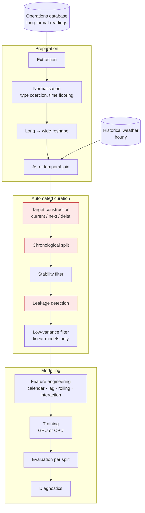

# GPU-Accelerated Load Forecasting Pipeline

[← Portfolio index](../README.md) · [繁體中文版](05-load-forecasting-pipeline.zh-TW.md)

    

> A time-series pipeline fusing equipment sensor telemetry with historical weather to forecast next-hour load, refactored from exploratory notebooks into a configurable package with transparent GPU-to-CPU fallback. **The first model scored worse than predicting the average**, and that diagnosis is the most useful thing here.

## 1. At a glance

| Item | Detail |
|---|---|
| **Type** | Time-series data engineering and regression pipeline |
| **Role** | Sole author, built during paid employment |
| **Period** | Roughly six weeks of recorded work |
| **Scale** | Sensor columns in the hundreds; three notebooks and a monolithic script replaced by a six-module package in one change |
| **Finding** | The chronological split reported real distribution shift the shuffled split would have hidden; the negative result is kept |
| **State** | Refactor complete; **no accuracy claim is made for the current model** |
| **Source** | Employer's property; not published |

## 2. Tech stack

| Layer | Technology |
|---|---|
| **Language** | Python, executed in a virtualised Linux environment for GPU support |
| **Data engineering** | GPU-accelerated dataframe library with a conventional dataframe fallback; as-of temporal joins; pivot and resample reshaping |
| **Modelling** | GPU-accelerated machine learning library (random forest, linear and regularised regression) with a conventional equivalent as fallback |
| **Data sources** | Relational operations database over a standard driver; an openly maintained historical weather dataset |
| **Presentation** | Standard plotting libraries: actual-versus-predicted, residuals, correlation, feature importance, time-series overlays |
| **Tooling** | Structured configuration objects, command-line entry point, dependency management |

## 3. Architecture

The three highlighted stages exist because of the first model’s failure: it scored worse than predicting the average. In the first version of this project, none of them did.

## 4. What was built

| Mechanism | Built with | Problem it solves |
|---|---|---|
| **Predict the change, not the value** | Target is next-hour minus current-hour; current value excluded from features | On an autoregressive series a model given the current value learns to copy it, scores excellently, and has learned nothing |
| **Chronological split, never shuffled** | Train, validation, test as consecutive periods | A shuffled split puts the neighbouring hours of every test sample into training; the score measures interpolation, not forecasting |
| **Automated feature gates** | Stability filter across all three splits, leakage detector, low-variance filter for linear models | Hundreds of sensor columns are not manually inspectable or reproducible; a column duplicating the target produces a near-perfect and embarrassing score |
| **Floor fine, then reshape** | Readings floored to a fine resolution before pivoting to the hourly interval | Averaging a binary sensor over an hour yields a fraction that is not the variable's meaning, and nothing downstream distinguishes it |
| **Weather as the clock, sensors matched backwards** | As-of join to the most recent prior sensor reading | Two irregular series cannot join on equality, and matching nearest-either-direction lets a future reading inform a past timestamp |
| **GPU with transparent fallback** | One availability check per stage selecting accelerated or conventional implementation | Without a fallback the project is unrunnable for anyone without the specific hardware, including the author elsewhere |
| **Notebooks into a package** | Six modules along pipeline stages, dataclass configuration, CLI entry point | Notebook execution order is implicit and state invisible; a result cannot be reproduced without knowing which cells ran |
| **Filters report what they drop** | Removal logged per gate | Silent feature removal turns a filter into a black box |

## 5. Limitations and what I would do differently

**The refactored pipeline was never run to completion.** The package exists, the notebooks driving it contain no saved output, and no metrics exist for the current modelling approach. Everything in §4 is reasoning that was implemented and not validated. This is the project's central limitation and I will not dress it up: the redesign is *untested*, and its correctness is argued rather than demonstrated.

**No baseline was established.** There is no recorded persistence baseline: the score from simply predicting that the next hour equals this one. Without it, no model score can be interpreted at all. This should have been the first thing built, before any model.

**No cross-validation.** A single chronological split is a single sample of the model's transfer behaviour. Rolling-origin validation over several folds would give a distribution rather than a point, and would have shown whether that failure was consistent or an artefact of one boundary.

**Most of the available weather data is unused.** Humidity and radiation in particular have a direct physical relationship to cooling load and are sitting unused in the merged table.

**No tests.** None. On a data pipeline where a silent transformation error produces plausible numbers, this is the gap that most deserves fixing, and it is a habit I adopted properly only on later projects.

**What I would do differently, in order:** establish the persistence baseline first; build rolling-origin validation before touching features; test the transformation stages; then explore the unused weather variables. In that order, because without the first two, nothing after them can be evaluated.

