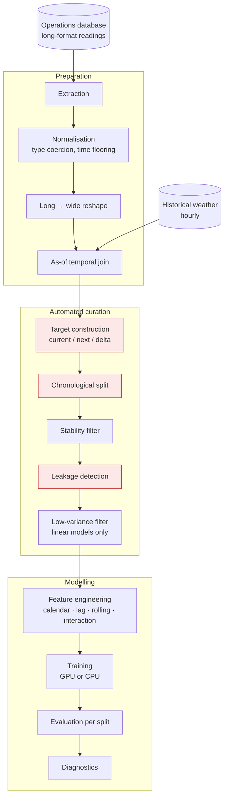

# GPU-Accelerated Load Forecasting Pipeline

[← Portfolio index](../README.md) · [繁體中文版](05-load-forecasting-pipeline.zh-TW.md)

    

> A time-series pipeline fusing equipment sensor telemetry with historical weather to forecast next-hour load, refactored from exploratory notebooks into a configurable package with transparent GPU-to-CPU fallback. **The first model scored worse than predicting the average**, and that diagnosis shaped the redesign. The redesigned version was validated on historical data: against actual meter readings it is about as accurate as the existing production model. It is not deployed yet.

## 1. At a glance

| Item | Detail |
|---|---|
| **Type** | Time-series data engineering and regression pipeline |
| **Predicts** | Equipment power consumption (meter readings) |
| **Role** | Sole author, built during paid employment |
| **Period** | Roughly six weeks of recorded work |
| **Scale** | Sensor columns in the hundreds; three notebooks and a monolithic script replaced by a six-module package in one change |
| **Finding** | The chronological split reported real distribution shift the shuffled split would have hidden; the negative result is kept |
| **State** | Validated on historical data: against actual meter readings, about as accurate as the company's existing model; **not deployed yet**. No accuracy figures are published |
| **Source** | Employer's property; not published |

## 2. Tech stack

| Layer | Technology |
|---|---|
| **Language** | Python, executed in a virtualised Linux environment for GPU support |
| **Data engineering** | GPU-accelerated dataframe library with a conventional dataframe fallback; as-of temporal joins; pivot and resample reshaping |
| **Modelling** | Gradient-boosted trees and a GPU-accelerated machine learning library (random forest, linear and regularised regression), each with a conventional fallback; randomised hyperparameter search; feature-importance screening before training |
| **Data sources** | Relational operations database over a standard driver; an openly maintained historical weather dataset |
| **Presentation** | Standard plotting libraries: actual-versus-predicted, residuals, correlation, feature importance, time-series overlays |
| **Tooling** | Structured configuration objects, command-line entry point, dependency management |

## 3. Architecture

```mermaid
flowchart TB
    SRC[("Operations database<br/>long-format readings")]
    WX[("Historical weather<br/>hourly")]

    subgraph Prep["Preparation"]
        ING["Extraction"]
        NORM["Normalisation<br/>type coercion, time flooring"]
        PIV["Long → wide reshape"]
        MERGE["As-of temporal join"]
    end

    subgraph Curate["Automated curation"]
        TGT["Target construction<br/>current / next / delta"]
        SPLIT["Chronological split"]
        STAB["Stability filter"]
        LEAK["Leakage detection"]
        VAR["Low-variance filter<br/>linear models only"]
    end

    subgraph Model["Modelling"]
        FE["Feature engineering<br/>calendar · lag · rolling · interaction"]
        TRAIN["Training<br/>GPU or CPU"]
        EVAL["Evaluation per split"]
        VIZ["Diagnostics"]
    end

    SRC --> ING --> NORM --> PIV --> MERGE
    WX --> MERGE
    MERGE --> TGT --> SPLIT
    SPLIT --> STAB --> LEAK --> VAR --> FE --> TRAIN --> EVAL --> VIZ

    style TGT fill:#fde8e8,stroke:#c53030
    style SPLIT fill:#fde8e8,stroke:#c53030
    style LEAK fill:#fde8e8,stroke:#c53030
```

The three highlighted stages exist because of the first model’s failure: it scored worse than predicting the average. In the first version of this project, none of them did.

## 4. What was built

| Mechanism | Built with | Problem it solves |
|---|---|---|
| **Predict the change, not the value** | Target is next-hour minus current-hour; current value excluded from features | On an autoregressive series a model given the current value learns to copy it, scores excellently, and has learned nothing |
| **Chronological split, never shuffled** | Train, validation, test as consecutive periods | A shuffled split puts the neighbouring hours of every test sample into training; the score measures interpolation, not forecasting |
| **Automated feature gates** | Stability filter across all three splits, leakage detector, low-variance filter for linear models | Hundreds of sensor columns are not manually inspectable or reproducible; a column duplicating the target produces a near-perfect and embarrassing score |
| **Floor fine, then reshape** | Readings floored to a fine resolution before pivoting to the hourly interval | Averaging a binary sensor over an hour yields a fraction that is not the variable's meaning, and nothing downstream distinguishes it |
| **Weather as the clock, sensors matched backwards** | As-of join to the most recent prior sensor reading | Two irregular series cannot join on equality, and matching nearest-either-direction lets a future reading inform a past timestamp |
| **GPU with transparent fallback** | One availability check per stage selecting accelerated or conventional implementation | Without a fallback the project is unrunnable for anyone without the specific hardware, including the author elsewhere |
| **Notebooks into a package** | Six modules along pipeline stages, dataclass configuration, CLI entry point | Notebook execution order is implicit and state invisible; a result cannot be reproduced without knowing which cells ran |
| **Filters report what they drop** | Removal logged per gate | Silent feature removal turns a filter into a black box |
| **Screen features, then train** | Features ranked by importance and only the top-ranked ones used; outdoor air temperature is one of the inputs | Feeding hundreds of columns into a model slows training and makes it easier to learn noise |
| **Fix nested-parallelism oversubscription** | The hyperparameter search's worker processes and the gradient-boosting library's OpenMP threads were both set to use every core, so threads grew to the square of the core count; the outer search is pinned to one process for gradient-boosted trees | Found while validating the GPU rewrite, from unusually low GPU utilisation: the existing CPU version's settings had processes and threads competing for the same cores, with no error |

## 5. Next steps

**Next steps, in order:** record a persistence baseline (predicting that the next hour equals this one) so model scores have a reference; move to rolling-origin validation over several folds to see whether results hold across time periods; add tests for the transformation stages, because a silent transformation error produces plausible numbers; then add the weather variables not yet used. Replacing the existing model in production comes after that.
