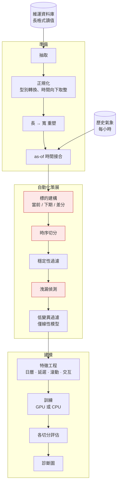

# GPU 加速負載預測管線

[← 作品集索引](../README.zh-TW.md) · [English version](05-load-forecasting-pipeline.md)

    

> 時間序列管線，融合設備感測遙測與歷史氣象資料預測下一小時負載，並從探索性 notebook 重構成可設定的套件，具備 GPU 到 CPU 的透明降級。**第一個模型比直接猜平均值還差**，而那次診斷是這裡最有用的東西。

## 1. 專案綱要

| 項目 | 內容 |
|---|---|
| **類型** | 時間序列資料工程與迴歸管線 |
| **角色** | 獨力完成，受雇期間 |
| **期間** | 約六週的有紀錄工作 |
| **規模** | 感測器欄位數以百計；三個 notebook 與一個單體腳本在一次變更中換成六模組套件 |
| **發現** | 時序切分回報了真實的分布偏移，而打亂切分會把它藏起來；負面結果被保留 |
| **狀態** | 重構完成；**對現行模型不做任何準確度宣稱** |
| **原始碼** | 雇主所有，不公開 |

## 2. 技術棧

| 層 | 技術 |
|---|---|
| **語言** | Python，在虛擬化 Linux 環境下執行以支援 GPU |
| **資料工程** | GPU 加速 dataframe 函式庫，附傳統 dataframe 備援；as-of 時間連接；pivot 與 resample 重塑 |
| **建模** | GPU 加速機器學習函式庫（random forest、線性與正則化迴歸）附傳統等價實作備援 |
| **資料來源** | 經標準驅動程式的關聯式營運資料庫；開放維護的歷史氣象資料集 |
| **呈現** | 標準繪圖函式庫：實際對預測、殘差、相關性、特徵重要性、時序疊圖 |
| **工具** | 結構化設定物件、命令列進入點、依賴管理 |

## 3. 架構

三個標紅的階段之所以存在，是因為第一版模型的失敗：它的表現比直接預測平均值更差。在這個專案的第一版裡，這三個階段一個都不存在。

## 4. 做了哪些事

| 做法 | 用什麼做 | 解決什麼問題 |
|---|---|---|
| **預測變化量，不預測值** | 目標是下一小時減當前小時；當前值排除在特徵外 | 自迴歸序列上，拿到當前值的模型會學成複製，分數漂亮但什麼都沒學到 |
| **時序切分，絕不打亂** | 訓練、驗證、測試是連續的時間段 | 打亂會把每個測試樣本的前後小時放進訓練集；分數量的是內插不是預測 |
| **自動化特徵閘門** | 跨三個切分的穩定性過濾、洩漏偵測、線性模型的低變異過濾 | 數百個感測欄位無法人工檢視也無法重現；與目標重複的欄位會給出近乎完美又難堪的分數 |
| **先細粒度向下取整，再重塑** | 讀數先取到細時間解析度，再 pivot 到小時區間 | 對二元感測器取一小時平均會得到一個不是變數本意的分數，下游沒有東西能分辨 |
| **氣象當時鐘、感測器往回配** | as-of 連接到最近一次「之前」的感測讀數 | 兩個不規則序列無法等值連接；往兩邊配最近值會讓未來的讀數影響過去的時間戳 |
| **GPU 加透明備援** | 每階段檢查一次可用性，選加速或傳統實作 | 沒有備援，沒有特定硬體的人跑不起來，包含作者在別處 |
| **notebook 重構成套件** | 沿管線階段切成六個模組、dataclass 設定、CLI 進入點 | notebook 的執行順序隱含、狀態不可見；不知道哪些 cell 跑過就無法重現結果 |
| **過濾器回報它丟了什麼** | 每道閘門記錄移除項 | 無聲移除特徵會讓過濾器變成黑箱 |

## 5. 限制，以及我會怎麼改

**重構後的管線從未被完整執行。** 套件存在，驅動它的 notebook 沒有任何儲存的輸出，而目前這套建模方法沒有任何指標。§4 的一切都是「已實作但未驗證」的推理。這是這個專案的核心限制，而我不會粉飾它：這次重新設計**未經測試**，它的正確性是被論證的，不是被證明的。

**沒有建立基準線。** 沒有任何持續性基準線的紀錄，也就是「直接預測下一小時等於這一小時」的分數。沒有它，任何模型分數都根本無法被詮釋。這應該是第一個被建立的東西，在任何模型之前。

**沒有交叉驗證。** 單一時序切分是模型轉移行為的單一樣本。跨數個 fold 的滾動起點驗證會給出一個分布而非一個點，也會顯示那次失敗是一致的、還是某一個邊界造成的產物。

**大部分可用的氣象資料未被使用。** 濕度與輻射尤其與冷卻負載有直接的物理關係，而它們就躺在接合後的表裡沒被用到。

**沒有測試。** 一個都沒有。在一條「靜默的轉換錯誤會產出看似合理的數字」的資料管線上，這是最該補的缺口，而這個習慣我是在後來的專案才真正建立起來的。

**我會怎麼改，依順序**：先建立持續性基準線；在碰特徵之前先建滾動起點驗證；測試轉換階段；然後才去探索未使用的氣象變數。就是這個順序，因為沒有前兩項，之後的一切都無法被評估。

