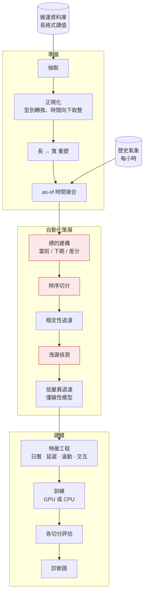

# GPU 加速負載預測管線

[← 作品集索引](../README.zh-TW.md) · [English version](05-load-forecasting-pipeline.md)

    

> 時間序列管線，融合設備感測遙測與歷史氣象資料預測下一小時負載，並從探索性 notebook 重構成可設定的套件，具備 GPU 到 CPU 的透明降級。**第一個模型比直接猜平均值還差**，那次診斷決定了後來的設計。重新設計後的版本用歷史資料驗證，對實際電表讀數的準確度與現行模型相當，目前尚未上線。

## 1. 專案綱要

| 項目 | 內容 |
|---|---|
| **類型** | 時間序列資料工程與迴歸管線 |
| **預測什麼** | 設備耗電量（電表讀值） |
| **角色** | 獨力完成，受雇期間 |
| **期間** | 約六週的有紀錄工作 |
| **規模** | 感測器欄位數以百計；三個 notebook 與一個單體腳本在一次變更中換成六模組套件 |
| **發現** | 時序切分回報了真實的分布偏移，而打亂切分會把它藏起來；負面結果被保留 |
| **狀態** | 以歷史資料驗證完成：對實際電表讀數，準確度與公司現行模型相當；**尚未上線**。不公開準確度數字 |
| **原始碼** | 雇主所有，不公開 |

## 2. 技術棧

| 層 | 技術 |
|---|---|
| **語言** | Python，在虛擬化 Linux 環境下執行以支援 GPU |
| **資料工程** | GPU 加速 dataframe 函式庫，附傳統 dataframe 備援；as-of 時間連接；pivot 與 resample 重塑 |
| **建模** | 梯度提升樹、GPU 加速機器學習函式庫（random forest、線性與正則化迴歸），各附傳統實作備援；超參數隨機搜尋；訓練前先做特徵重要度篩選 |
| **資料來源** | 經標準驅動程式的關聯式營運資料庫；開放維護的歷史氣象資料集 |
| **呈現** | 標準繪圖函式庫：實際對預測、殘差、相關性、特徵重要性、時序疊圖 |
| **工具** | 結構化設定物件、命令列進入點、依賴管理 |

## 3. 架構

```mermaid
flowchart TB
    SRC[("維運資料庫<br/>長格式讀值")]
    WX[("歷史氣象<br/>每小時")]

    subgraph Prep["準備"]
        ING["抽取"]
        NORM["正規化<br/>型別轉換、時間向下取整"]
        PIV["長 → 寬 重塑"]
        MERGE["as-of 時間接合"]
    end

    subgraph Curate["自動化策展"]
        TGT["標的建構<br/>當前 / 下期 / 差分"]
        SPLIT["時序切分"]
        STAB["穩定性過濾"]
        LEAK["洩漏偵測"]
        VAR["低變異過濾<br/>僅線性模型"]
    end

    subgraph Model["建模"]
        FE["特徵工程<br/>日曆 · 延遲 · 滾動 · 交互"]
        TRAIN["訓練<br/>GPU 或 CPU"]
        EVAL["各切分評估"]
        VIZ["診斷圖"]
    end

    SRC --> ING --> NORM --> PIV --> MERGE
    WX --> MERGE
    MERGE --> TGT --> SPLIT
    SPLIT --> STAB --> LEAK --> VAR --> FE --> TRAIN --> EVAL --> VIZ

    style TGT fill:#fde8e8,stroke:#c53030
    style SPLIT fill:#fde8e8,stroke:#c53030
    style LEAK fill:#fde8e8,stroke:#c53030
```

三個標紅的階段之所以存在，是因為第一版模型的失敗：它的表現比直接預測平均值更差。在這個專案的第一版裡，這三個階段一個都不存在。

## 4. 做了哪些事

| 做法 | 用什麼做 | 解決什麼問題 |
|---|---|---|
| **預測變化量，不預測值** | 目標是下一小時減當前小時；當前值排除在特徵外 | 自迴歸序列上，拿到當前值的模型會學成複製，分數漂亮但什麼都沒學到 |
| **時序切分，絕不打亂** | 訓練、驗證、測試是連續的時間段 | 打亂會把每個測試樣本的前後小時放進訓練集；分數量的是內插不是預測 |
| **自動化特徵閘門** | 跨三個切分的穩定性過濾、洩漏偵測、線性模型的低變異過濾 | 數百個感測欄位無法人工檢視也無法重現；與目標重複的欄位會給出近乎完美又難堪的分數 |
| **先細粒度向下取整，再重塑** | 讀數先取到細時間解析度，再 pivot 到小時區間 | 對二元感測器取一小時平均會得到一個不是變數本意的分數，下游沒有東西能分辨 |
| **氣象當時鐘、感測器往回配** | as-of 連接到最近一次「之前」的感測讀數 | 兩個不規則序列無法等值連接；往兩邊配最近值會讓未來的讀數影響過去的時間戳 |
| **GPU 加透明備援** | 每階段檢查一次可用性，選加速或傳統實作 | 沒有備援，沒有特定硬體的人跑不起來，包含作者在別處 |
| **notebook 重構成套件** | 沿管線階段切成六個模組、dataclass 設定、CLI 進入點 | notebook 的執行順序隱含、狀態不可見；不知道哪些 cell 跑過就無法重現結果 |
| **過濾器回報它丟了什麼** | 每道閘門記錄移除項 | 無聲移除特徵會讓過濾器變成黑箱 |
| **先篩特徵，再訓練** | 依特徵重要度排序，只用排名前段的特徵訓練；外氣溫度是輸入之一 | 數百個欄位全丟進模型，訓練慢、也更容易學到雜訊 |
| **修掉巢狀並行的執行緒過度訂閱** | 超參數搜尋外層的多 process 與梯度提升樹內層的 OpenMP 執行緒同時全開，會讓執行緒數變成核心數的平方；改成梯度提升樹時外層固定單一 process | 做 GPU 改寫驗證時，從 GPU 使用率偏低追到的：原本的 CPU 版本設定讓多個 process 與執行緒互搶資源，而且不會報錯 |

## 5. 下一步

**下一步，依順序**：先記錄持續性基準線（「下一小時等於這一小時」）的分數，讓模型分數有參照；再改成跨數個 fold 的滾動起點驗證，看結果在不同時間段是否穩定；接著補轉換階段的測試，因為靜默的轉換錯誤會產出看似合理的數字；最後才加入其他還沒用到的氣象變數。驗證過之後，才是取代現行模型、正式上線。
