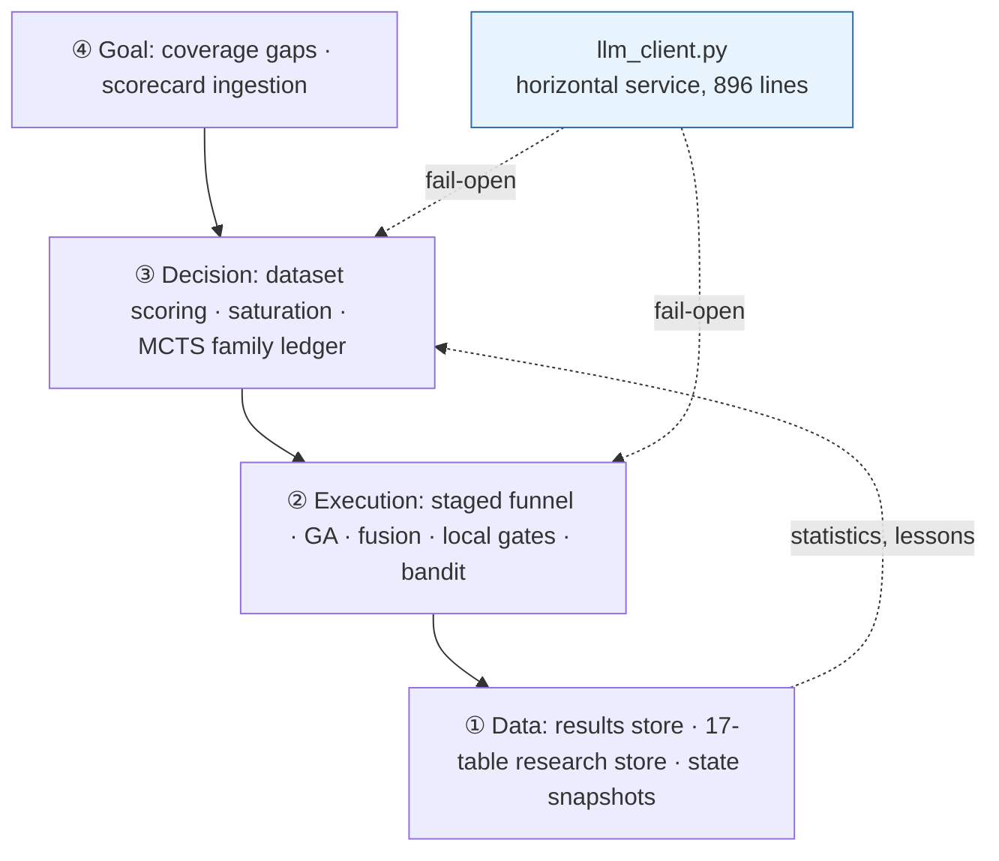

# Autonomous Research Platform

[← Portfolio index](../README.md) · [繁體中文版](01-alpha-research-platform.zh-TW.md)

    

> An unattended research pipeline: it generates hypotheses, spends a hard daily quota of external evaluations on the ones a bandit and an MCTS ledger rank highest, and submits what clears a validation gate. Five LLM providers sit behind one module with disk-persisted circuit breakers.

## 1. At a glance

| Item | Detail |
|---|---|
| **Type** | Autonomous research pipeline · long-running, unsupervised |
| **Role** | Sole author |
| **Period** | 2026-05-29 to present · 111-day unbroken run |
| **Size** | 61 Python modules · ~30,800 LOC own source · 612 commits, 64 of them reverts or rewrites |
| **Throughput** | 193,627 simulations over 91 days · 66,355 LLM calls over 65 days |
| **State** | Running unattended |
| **Source** | Private · read access can be arranged for hiring conversations |

## 2. Tech stack

| Layer | Technology |
|---|---|
| **Language** | Python 3.9 |
| **Core libraries** | `requests` 2.32.3 · `pandas` 2.2.3 · `numpy` 2.0.2 (pinned) |
| **Service & UI** | FastAPI ≥0.128 · uvicorn ≥0.39 · pydantic ≥2.13 · Vue 3 dashboard |
| **LLM providers** | 3 × OpenAI-compatible HTTP · 1 × vendor inference service · 1 × local CLI model |
| **Resilience** | Per-provider circuit breaker (3 fails → 900 s cooldown), JSON state with `os.replace` atomic write, deterministic fallback path |
| **Structured output** | `require_key` contracts · escape repair · balanced-brace extraction · strict mode · provider-native JSON mode |
| **Search algorithms** | UCB + Thompson sampling (scope-prefixed arm keys) · MCTS/UCT with max-backpropagation · GA with 5 mutation operators |
| **Storage** | SQLite × 2: results store keyed `expression × region × universe × delay`; 17-table research store |
| **Scheduling** | Long-running loop, each job dispatched as its own subprocess |
| **Observability** | Per-call tracing tagged with site and role; file logging; usage accounting |

## 3. Architecture

```text
alpha_machine/
├── algo/           bandit (UCB/Thompson) · MCTS/UCT ledger · GA
├── ...
llm_client.py       896 lines — the single exit point for every model call
run_miner.py        5,770 lines — the staged funnel
loop_miner.py       2,041 lines — the long-running dispatcher
store.py            SQLite results store (composite key)
auth_bridge.py      session bridge
api_server.py       FastAPI + Vue dashboard over the same stores
```



**Every layer degrades into the one below.** `fail-open` is a system-wide invariant: the LLM layer failing reduces the system to deterministic search, it does not stop it.

## 4. What was built

| Mechanism | Built with | Problem it solves |
|---|---|---|
| **Single exit point for all model calls** | One 896-line module, provider-agnostic | Timeout, breaker, JSON repair and retry semantics are shared failure modes; per-caller handling drifts within weeks |
| **Cross-process circuit breaker** | JSON state + `os.replace` atomic write | Every job is a fresh subprocess, so in-memory breaker state never learns and each job re-pays the full timeout |
| **Structured-output contract** | `require_key` + deterministic escape repair as a second attempt only | Valid JSON of the wrong shape reads downstream as "found nothing"; repair that touches valid input is worse than none |
| **Explicit degradation contract** | Survivor-count ladder, 0/1/≥2 | An ensemble without a written contract behaves unpredictably as providers fail, which they do constantly |
| **Per-generator timeout resolved as `min`** | `min(shared, per_generator)` | Batch latency equals the slowest member; "caller wins" silently bypasses every per-generator setting |
| **Scope-prefixed bandit arms** | `region::universe::op::field`, legacy key as prior | Pooling outcomes across market scopes lets one region's dead end suppress sampling elsewhere |
| **Load-failure guard on state** | `_LOAD_FAILED` flag + atomic write | A read exception returning `{}` is indistinguishable from a first run, and the next save overwrites months of learning |
| **Staged funnel ordered by cost** | Local hard gates → bandit ranking → simulate | A local gate costs microseconds, a simulation costs quota; order by expense, not by logical grouping |

## 5. Key implementation details

<details>
<summary><b>The exploration constant that stopped the search from searching</b></summary>

UCB scores an arm as `exploit + explore`. The textbook exploration term is `sqrt(2·ln N / t)`. With roughly 2,793 arms at ~8 trials each, that evaluates to **≈1.58**: against an exploit term, the win rate, whose entire observed range was **0.06 to 0.72**.

The bonus was more than twice the full spread of the quantity it was supposed to be traded against, so ordering was decided almost entirely by "least tried". **UCB had become a novelty ranker while reporting healthy statistics.**

```python
# UCB 探索係數（2026-08-07 尺度修正）：原公式 sqrt(2·ln N / t) 在現場（2793 arms、~8 trial/arm）
# 算出 ≈1.58——比 win_rate 全距（0.06-0.72）大兩倍，UCB 退化成「沒試過的先上」的新奇度排序。
# 比照精煉軌 UCT 的同款修正（run_miner mcts_c 1.4→0.3），讓 exploit 項真正參與決策。
UCB_C = 0.3

def score_ucb(arm: dict, total_trials: int, explore_scale: float = 1.0) -> float:
    t = arm.get("trials", 0)
    if t == 0:
        return float("inf")
    win_rate = _get_total_score(arm) / t
    explore = UCB_C * math.sqrt(math.log(max(2, total_trials)) / t) * explore_scale
    return win_rate + explore
```

The same defect existed in the MCTS track with a different constant (`mcts_c` 1.4 → 0.3), found by the same check.

**The general point is about how it was found, not what it was.** Nothing crashed, no number looked implausible, and the arm statistics were healthy. The only way to see it was to compute the magnitude of each term and compare them, which the code will never tell you on its own. An exploration constant is meaningful only relative to the scale and spread of the reward it competes with, and the textbook values assume many trials over few arms rather than the inverse.

</details>

<details>
<summary><b>Bandit state: scope in the key, and a guard against silent zeroing</b></summary>

Arms were originally keyed `op_category::field_category`, for example `ts_rank::anl4`, pooling outcomes from every market scope. One region's structural dead end therefore suppressed sampling of the same operator elsewhere, where it worked. The key now carries the scope, and old keys are read as a prior rather than discarded:

```python
def get_arm(weights: Dict[str, dict], expr: str) -> dict:
    """讀 arm：scoped key 優先，缺 → 舊（無 scope）key 當先驗 fallback（避免全量重學的探索風暴）。"""
    k = arm_key(expr)
    arm = weights.get(k)
    if arm is not None:
        return arm
    if _scope_ctx["scope"]:
        legacy = k.split("::", 1)[1]
        return weights.get(legacy, {})
    return {}
```

**Reading the legacy key as a prior is the part worth copying.** Discarding the old statistics on a key migration is correct and also triggers an exploration storm: every arm returns to zero trials, every arm scores `inf`, and the system spends days re-learning what it already knew.

The state file behind this holds **10,245 arms across 281,104 trials**, and the comment above the load guard is the reason it exists:

```python
# 讀取失敗旗標：與 `refine_state` 同一套防護（2026-09-09）。
# ⚠ 這裡的風險比 refine_ledger 更高：①同樣是「讀取例外 → 靜默回 {} → 下次 save 寫回去」
# ②原本 `open(path,"w")` **不是原子寫**，寫到一半崩潰就直接毀檔（ledger 至少有 tmp+os.replace）。
# 檔案裡是 10,245 個 arm／281,104 次 trial 的取樣學習成果，歸零不會有任何錯誤訊息，
# 只會表現成「bandit 排序突然變回隨機、挖掘效率下降」。
_LOAD_FAILED = False
```

A read exception returning `{}` is indistinguishable from a first run, and the next save writes the empty dict back over months of learning. The failure mode is not an exception; it is the search quietly becoming random. The fix is a flag that refuses to save when the load failed, plus atomic replace on write.

</details>

<details>
<summary><b>One module owns every provider call, and its breaker lives on disk</b></summary>

All five providers are reached through one 896-line module. The circuit breaker is per provider, and its state is a file:

```python
_CB_THRESHOLD = 3
_CB_COOLDOWN_S = 900
_cb_state: dict[str, dict] = {}   # provider -> {"fails": int, "open_until": float}
# CB 狀態落地檔案跨進程共享：loop 每個精煉/實驗 job 都是新 subprocess——per-process 記憶體
# 讓 CB 永遠學不會、每輪對掛掉的 provider 重付 timeout 學費（2026-07-10 審計）。
_CB_PATH = os.path.join(os.path.dirname(os.path.abspath(__file__)), "output", "llm_cb_state.json")
```

```python
def _cb_save() -> None:
    try:
        tmp = _CB_PATH + ".tmp"
        with open(tmp, "w", encoding="utf-8") as f:
            json.dump(_cb_state, f)
        os.replace(tmp, _CB_PATH)     # 原子替換：寫到一半崩潰不會留半截檔
    except Exception:
        pass
```

**The disk is not an optimisation, it is the only place the breaker can learn.** Every refinement and experiment job is a fresh subprocess, so per-process memory means the breaker starts empty every time and each job re-pays the full timeout to rediscover a provider that has been down for hours. `os.replace` is atomic on POSIX, so a crash mid-write cannot leave a truncated file the next process fails to parse.

Measured over a 15-day window: the breaker opened **293 times** and the deterministic fallback engaged **254 times**, with no pipeline stall.

The cost is stated where it belongs: this is shared mutable state with no locking, and concurrent jobs can lose a counter update. Acceptable for an advisory breaker, not for anything gating a costly or irreversible action.

</details>

<details>
<summary><b>A response that parses is not a response that succeeded</b></summary>

The dangerous output is not invalid JSON, which raises immediately. It is **valid JSON of the wrong shape**, which propagates as an empty result and reads downstream as "the model found nothing". So parsing is contract-checked:

```python
def _parse_json(content: str, require_key: str | None, strict: bool = False):
    raw = (content or "").strip()
    cands = [raw] if strict else list(json_candidates(raw))
    for cand in cands:
        attempts = (cand,) if strict else (cand, _repair_json_escapes(cand))
        for attempt in attempts:
            try:
                obj = json.loads(attempt)
            except Exception:
                continue
            if require_key is not None and not (isinstance(obj, dict) and require_key in obj):
                break      # 解析成功但缺 require_key → 換下一個候選
            return obj
    return None
```

Repair handles the malformations that actually recur (illegal backslash escapes from LaTeX-like notation, curly quotation marks, trailing commas), and **only runs on candidates `json.loads` has already rejected**:

```python
s = re.sub(r'\\(?!["\\/bfnrtu])', "", s)   # ① 非法逃逸的反斜線
s = s.replace("“", '"').replace("”", '"')  # ② 彎引號
s = re.sub(r",\s*([}\]])", r"\1", s)       # ③ 尾逗號
```

**That ordering is the whole safety argument.** A repair function that alters valid input is worse than no repair at all; because valid JSON parses on the first attempt and never reaches the repair path, this one cannot corrupt good data. It is covered by an inline self-test with eight assertions, runnable with no network.

`complete_json()` defaults `json_mode=True`, on the reasoning that a function whose name says JSON has no business asking for prose. A controlled A/B on constrained decoding with one variable and an identical 91k-character production prompt: provider A went from 8 parseable entries to 13, provider B from 0 (returned prose) to 4. *n=1 per arm, directional rather than a rate.*

</details>

<details>
<summary><b>The degradation contract, and why the timeout takes <code>min</code></b></summary>

The survivor count determines behaviour explicitly, so "three of five providers are down" is an ordinary tested state rather than an incident:

```text
0 survivors   → return None; caller takes the deterministic path
1 survivor    → use it directly, log as degraded
≥2 survivors  → synthesizer converges them
synthesizer fails → fall back to the designated primary's standalone result,
                    else the first survivor
```

Measured over 15 days: 2,216 rounds integrated, 65 degraded to a single model, **97.2% retained multi-model integration**.

Per-generator timeouts resolve as `min`, never "caller wins", and the comment explains why in terms of a real incident:

```python
# ⚠ 語意是「這個 generator 最多等 N 秒」＝取 min，不是「優先用誰」：
# refine_via_agnes 的 timeout 預設 240 且呼叫端沒覆寫 → 會一路傳成 ensemble(timeout=240)，
# 若寫成「呼叫端優先」，per-generator 設定就永遠被繞過、靜默失效。
return min(base, int(_t)) if _t else base
```

Generators run in parallel and the batch waits for all of them, so batch latency is the slowest member. One reasoning-heavy model produced **186 timeouts over three days** while the other three handled the identical prompt, and each failure made the batch wait the full 240 s when it normally finished in 30–60 s: **≈10.8 hours of refinement time spent waiting**. A per-generator ceiling caps that; `min` semantics are what stop a caller's default from silently bypassing it.

The synthesizer's ceiling is per-provider for the same reason. A 120 s limit set for a provider whose healthy latency is 36–60 s was cutting off a different synthesizer whose *healthy* latency is 97–111 s: over six days, **8 failures all landing at 120.1–120.2 s** against 6 successes at 96.8–111.4 s. A single global ceiling is not a safety limit, it is a bias against slow-but-working models.

</details>

## 6. Measured results

| Pipeline | Simulations | Cleared the local gate | Submittable | Per simulation | Per gate-clearance |
|---|---|---|---|---|---|
| Brute-force mining | 100,992 | 8,600 | 36 | **0.036%** | **0.42%** |
| LLM-guided refinement | 10,192 | 4,291 | 155 | **1.52%** | **3.61%** |
| **Ratio** | 1/10 the compute | | 4.3× the output | **42×** | **8.6×** |

**Both denominators are shown deliberately.** The per-simulation ratio is the larger number and the weaker claim; the per-gate-clearance ratio compares the pipelines at the point where they are doing comparable work.

> [!WARNING]
> **Selection effect, stated plainly.** The refinement pipeline's input is pre-filtered near-misses, not a random sample. The defensible claim is that directing scarce evaluations at near-misses beats sampling uniformly, **not** that the LLM is 8.6× smarter. A controlled version would route a random subset of near-misses to brute force, and has not been run.

Provider success rates over 65 days and 66,355 calls: **99.1% · 97.6% · 87.2% · 82.2% · 67.0%**. A 67% provider is worth keeping if and only if the machinery around it treats failure as normal, which is the argument for §3 and §5. Providers are anonymised deliberately: the engineering point is the spread, and a reliability league table from one account's workload would be a stronger claim than the data supports.

## 7. Limitations

- **No test suite.** One inline self-test on the JSON repair path and nothing else. For a system whose characteristic failure is plausible wrong output, that is the wrong gap to have; contract tests around the degradation ladder in §5 are the first thing I would add.
- **No control group for the ensemble.** Over 65 days the system never ran with two or fewer providers, so "four generators beat one" is reasoning, not evidence. **No figure in this document measures the ensemble's benefit.**
- **Breaker state has no locking** (see the breaker section). Concurrent jobs can lose a counter update.
- **Permanent-error classification is string matching** against provider error text. A provider rewording a message turns a loud failure back into a silent one.
- **Local gates are unvalidated as filters.** Nothing measures how many candidates they reject that the remote validator would have accepted, so the false-negative rate of the cheapest and most-used component is unknown.
- **Combined performance is −0.29.** The platform scorecard reached GOLD tier on breadth (70 alphas, 12 pyramid seats, a 111-day unbroken streak), and breadth is not profitability. **Any reading of this as a successful trading strategy is a reading it does not support.**
- **Reliability figures are windowed, not cumulative**: 15 days for breaker counts, 65 for success rates, because log retention is 14 days.

In order: measure the local gates' false-negative rate, because it could invalidate the funnel's central premise; contract tests for the degradation ladder; a deliberate single-provider window; then normalise the reward scale so the exploration constant is derived rather than tuned.

## 8. Reference

| Item | Detail |
|---|---|
| **Runtime** | Python 3.9, pinned: `requests` 2.32.3 · `pandas` 2.2.3 · `numpy` 2.0.2 |
| **Dashboard** | `fastapi` ≥0.128 · `uvicorn` ≥0.39 · `pydantic` ≥2.13 · Vue, 5 files |
| **Providers** | 3 × OpenAI-compatible HTTP, 1 × vendor inference service, 1 × local CLI model under existing subscription credentials |
| **Resilience** | Per-provider breaker, 3 consecutive failures → 900 s cooldown, JSON state with `os.replace` atomic write; per-generator and per-synthesizer `min` timeout resolution; deterministic fallback path |
| **Structured output** | `require_key` contracts, escape repair as a second attempt only, balanced-brace extraction, strict mode, provider-native JSON mode |
| **Ensemble** | Four lens-prefixed generators dispatched on a thread pool, separate synthesizer with a cross-quota-pool fallback chain, optional attacker/defender/manager debate with a code-enforced retention floor of `min(2, base_count)` |
| **Search** | UCB and Thompson sampling with scope-prefixed arm keys (`op::field`), state at `~/.wq_gui_bandit.json` chmod 600; MCTS/UCT with max-backpropagation; GA with crossover and five mutation operators including evaluation settings |
| **Storage** | SQLite: primary store keyed expression × region × universe × delay, plus a 17-table research store (19,173 template statistics · 6,055 lessons · 5,375 insights · 3,453 hypotheses · 1,322 experiments) |
| **Observability** | Per-call tracing tagged with site and role, which is what makes every per-provider figure above available at all |

**Not in this document:** the domain itself, prompt content and the lens prefixes, provider identities, and any credential or endpoint.

**Availability.** The implementation is private. Read access can be arranged for hiring conversations.

---

[Portfolio index](../README.md)

---
