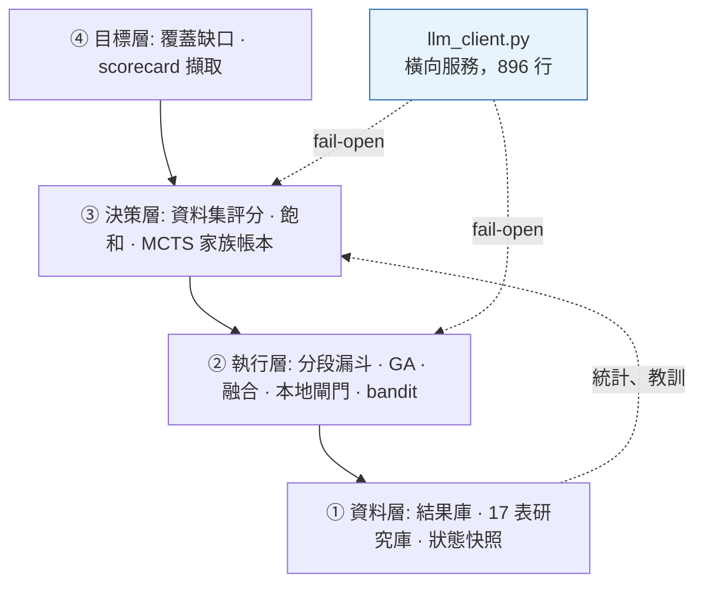

# 自主研究平台

[← 作品集索引](../README.zh-TW.md) · [English version](01-alpha-research-platform.md)

    

> 一條無人看管的研究管線：產生假說、把每日硬額度的外部評估花在 bandit 與 MCTS 帳本評分最高的候選上，並提交通過驗證閘的結果。五個 LLM 供應商收在一個模組後面，斷路器狀態寫入磁碟。

## 1. 專案綱要

| 項目 | 內容 |
|---|---|
| **類型** | 自主研究管線 · 常駐、無人監督 |
| **角色** | 獨力完成 |
| **期間** | 2026-05-29 至今 · 連續運行 111 天 |
| **規模** | 61 個 Python 模組 · 約 30,800 行自有原始碼 · 612 個 commit，其中 64 個是 revert 或重寫 |
| **吞吐** | 91 天 193,627 次模擬 · 65 天 66,355 次 LLM 呼叫 |
| **狀態** | 無人看管運行中 |
| **原始碼** | 私有 · 面談階段可安排讀取權限 |

## 2. 技術棧

| 層 | 技術 |
|---|---|
| **語言** | Python 3.9 |
| **核心函式庫** | `requests` 2.32.3 · `pandas` 2.2.3 · `numpy` 2.0.2（版本鎖定） |
| **服務與介面** | FastAPI ≥0.128 · uvicorn ≥0.39 · pydantic ≥2.13 · Vue 3 儀表板 |
| **LLM 供應商** | 3 × OpenAI 相容 HTTP · 1 × 廠商推論服務 · 1 × 本機 CLI 模型 |
| **韌性** | 逐供應商斷路器（3 次失敗 → 900 秒冷卻）、JSON 狀態以 `os.replace` 原子寫入、確定性備援路徑 |
| **結構化輸出** | `require_key` 契約 · 逃逸修復 · 平衡括號抽取 · strict 模式 · 供應商原生 JSON 模式 |
| **搜尋演算法** | UCB + Thompson 取樣（arm key 帶 scope 前綴）· 取最大值回傳的 MCTS/UCT · 含五種突變算子的 GA |
| **儲存** | SQLite × 2：結果庫以 `expression × region × universe × delay` 為複合鍵；17 張表的研究庫 |
| **排程** | 常駐迴圈，每個 job 派成自己的子行程 |
| **觀測** | 逐次呼叫追蹤（標記站點與角色）、檔案日誌、用量記帳 |

## 3. 架構

```text
alpha_machine/
├── algo/           bandit（UCB/Thompson）· MCTS/UCT 家族帳本 · GA
├── ...
llm_client.py       896 行 — 所有模型呼叫的唯一出口
run_miner.py        5,770 行 — 分段漏斗
loop_miner.py       2,041 行 — 常駐派送器
store.py            SQLite 結果庫（複合主鍵）
auth_bridge.py      session 橋接
api_server.py       FastAPI + Vue 儀表板，讀同一組資料庫
```



**每一層都降級成它下面那一層。** `fail-open` 是系統層級的不變式：LLM 層失效只會讓系統退回確定性搜尋，不會讓它停下來。

## 4. 做了哪些事

| 做法 | 用什麼做 | 解決什麼問題 |
|---|---|---|
| **所有模型呼叫的單一出口** | 一個 896 行、provider-agnostic 的模組 | timeout、斷路器、JSON 修復與重試語意是共用的失效模式；各自處理會在幾週內走鐘 |
| **跨行程的斷路器** | JSON 狀態 + `os.replace` 原子寫入 | 每個 job 都是新子行程，記憶體內的斷路器狀態永遠學不會，每個 job 都要重付完整 timeout |
| **結構化輸出契約** | `require_key` + 只在第二次嘗試才跑的確定性逃逸修復 | 形狀錯誤的合法 JSON 在下游讀起來像「什麼都沒找到」；會改動合法輸入的修復比不修復更糟 |
| **明文的降級契約** | 存活者數量階梯：0 / 1 / ≥2 | 沒有寫下契約的 ensemble，會在供應商不斷失效時行為難以預測 |
| **逐 generator 的 timeout 取 `min`** | `min(shared, per_generator)` | 批次延遲等於最慢的那個；「呼叫端優先」會靜默繞過每一個 per-generator 設定 |
| **Bandit arm key 帶 scope 前綴** | `region::universe::op::field`，舊 key 當先驗 | 跨市場範圍合併結果，會讓某個 region 的死路壓低同一 operator 在別處的取樣 |
| **狀態載入失敗的防護** | `_LOAD_FAILED` 旗標 + 原子寫入 | 讀取例外回傳 `{}` 與「第一次執行」無法區分，而下次儲存就覆蓋掉數月的學習 |
| **依成本排序的分段漏斗** | 本地硬閘門 → bandit 排序 → 模擬 | 本地閘門花微秒、模擬花配額；要按花費排序，不按邏輯分組 |

## 5. 關鍵實作細節

<details>
<summary><b>那個讓搜尋停止搜尋的探索常數</b></summary>

UCB 把一個 arm 的分數算成 `exploit + explore`。教科書的探索項是 `sqrt(2·ln N / t)`。在現場，約 2,793 個 arm、每個約 8 次試驗，它算出來是 **≈1.58**，而它要對抗的 exploit 項是 win rate，整個觀測全距只有 **0.06 到 0.72**。

探索加成比它該被拿來權衡的那個量的全距還大兩倍，所以排序幾乎完全由「試得最少」決定。**UCB 已經變成一個新奇度排序器，同時回報著健康的統計數字。**

```python
# UCB 探索係數（2026-08-07 尺度修正）：原公式 sqrt(2·ln N / t) 在現場（2793 arms、~8 trial/arm）
# 算出 ≈1.58——比 win_rate 全距（0.06-0.72）大兩倍，UCB 退化成「沒試過的先上」的新奇度排序。
# 比照精煉軌 UCT 的同款修正（run_miner mcts_c 1.4→0.3）讓 exploit 項真正參與決策。
UCB_C = 0.3

def score_ucb(arm: dict, total_trials: int, explore_scale: float = 1.0) -> float:
    t = arm.get("trials", 0)
    if t == 0:
        return float("inf")
    win_rate = _get_total_score(arm) / t
    explore = UCB_C * math.sqrt(math.log(max(2, total_trials)) / t) * explore_scale
    return win_rate + explore
```

同樣的缺陷用不同的常數存在於 MCTS 那一軌（`mcts_c` 1.4 → 0.3）是同一次檢查找到的。

**通則在於它是怎麼被發現的，不在於它是什麼。** 沒有東西崩潰、沒有數字看起來不合理、arm 統計是健康的。唯一能看見它的方法是**把每一項的量級算出來互相比較**，而程式碼永遠不會主動告訴你這件事。一個探索常數只有相對於它所競爭的獎勵尺度與全距才有意義，而教科書的值假設的是「少數 arm、大量試驗」，現場正好相反。

</details>

<details>
<summary><b>Bandit 狀態：把 scope 放進 key，以及一道防止無聲歸零的閘</b></summary>

Arm 原本的 key 是 `op_category::field_category`，例如 `ts_rank::anl4`，把所有市場範圍的結果混在一起算。於是某個 region 的結構性死路，會壓低同一個 operator 在其他 region 的取樣，即使它在那邊是有效的。現在 key 帶著 scope，而舊 key 被當成先驗讀取而不是丟棄：

```python
def get_arm(weights: Dict[str, dict], expr: str) -> dict:
    """讀 arm：scoped key 優先，缺 → 舊（無 scope）key 當先驗 fallback（避免全量重學的探索風暴）。"""
    k = arm_key(expr)
    arm = weights.get(k)
    if arm is not None:
        return arm
    if _scope_ctx["scope"]:
        legacy = k.split("::", 1)[1]
        return weights.get(legacy, {})
    return {}
```

**把舊 key 當先驗讀，是這裡最值得抄走的一點。** key 遷移時丟掉舊統計是「正確」的，同時也會觸發一場探索風暴：每個 arm 回到零次試驗、每個 arm 都算出 `inf`，系統會花好幾天重學它本來就知道的事。

支撐這一切的狀態檔裝著 **10,245 個 arm、281,104 次試驗**，而那道載入防護上面的註解就是它存在的理由：

```python
# 讀取失敗旗標：與 `refine_state` 同一套防護（2026-09-09）。
# ⚠ 這裡的風險比 refine_ledger 更高：①同樣是「讀取例外 → 靜默回 {} → 下次 save 寫回去」
# ②原本 `open(path,"w")` **不是原子寫**，寫到一半崩潰就直接毀檔（ledger 至少有 tmp+os.replace）。
# 檔案裡是 10,245 個 arm／281,104 次 trial 的取樣學習成果，歸零不會有任何錯誤訊息，
# 只會表現成「bandit 排序突然變回隨機、挖掘效率下降」。
_LOAD_FAILED = False
```

讀取例外回傳 `{}`，與「第一次執行」在現象上無法區分，而下一次儲存就把那個空 dict 寫回去、蓋掉數個月的學習。失效模式不是例外，是**搜尋悄悄變回隨機**。解法是一個旗標，載入失敗就拒絕儲存，加上寫入時的原子替換。

</details>

<details>
<summary><b>一個模組擁有所有供應商呼叫，而它的斷路器住在磁碟上</b></summary>

五個供應商全部經由同一個 896 行模組。斷路器是逐供應商的，而它的狀態是一個檔案：

```python
_CB_THRESHOLD = 3
_CB_COOLDOWN_S = 900
_cb_state: dict[str, dict] = {}   # provider -> {"fails": int, "open_until": float}
# CB 狀態落地檔案跨進程共享：loop 每個精煉/實驗 job 都是新 subprocess——per-process 記憶體
# 讓 CB 永遠學不會、每輪對掛掉的 provider 重付 timeout 學費（2026-07-10 審計）。
_CB_PATH = os.path.join(os.path.dirname(os.path.abspath(__file__)), "output", "llm_cb_state.json")
```

```python
def _cb_save() -> None:
    try:
        tmp = _CB_PATH + ".tmp"
        with open(tmp, "w", encoding="utf-8") as f:
            json.dump(_cb_state, f)
        os.replace(tmp, _CB_PATH)     # 原子替換：寫到一半崩潰不會留半截檔
    except Exception:
        pass
```

**寫入磁碟不是最佳化，它是斷路器唯一能學習的地方。** 每個精煉與實驗 job 都是新的子行程，所以 per-process 記憶體意味著斷路器每次都從空的開始，每個 job 都要重付一次完整 timeout，才能重新發現一個已經掛了好幾小時的供應商。`os.replace` 在 POSIX 上是原子的，所以寫到一半崩潰不會留下一個讓下個行程解析失敗的半截檔。

在 15 天的區間內量到：斷路器開啟 **293 次**、確定性備援啟動 **254 次**，管線沒有停過。

代價寫在它該在的地方：這是沒有鎖的共用可變狀態，並行 job 可能遺失一次計數更新。對一個諮詢性質的斷路器可以接受，對任何把關昂貴或不可逆動作的東西則不行。

</details>

<details>
<summary><b>能解析的回應不等於成功的回應</b></summary>

危險的輸出不是非法 JSON，那會立刻拋錯。是**格式合法但形狀錯誤的 JSON**，它會以空結果的形式往下傳，在下游讀起來像「模型什麼都沒找到」。所以解析是帶契約的：

```python
def _parse_json(content: str, require_key: str | None, strict: bool = False):
    raw = (content or "").strip()
    cands = [raw] if strict else list(json_candidates(raw))
    for cand in cands:
        attempts = (cand,) if strict else (cand, _repair_json_escapes(cand))
        for attempt in attempts:
            try:
                obj = json.loads(attempt)
            except Exception:
                continue
            if require_key is not None and not (isinstance(obj, dict) and require_key in obj):
                break      # 解析成功但缺 require_key → 換下一個候選
            return obj
    return None
```

修復只處理真的會反覆出現的毛病：來自 LaTeX 式記法的非法反斜線逃逸、彎引號、尾逗號，而且**只在 `json.loads` 已經拒絕過的候選上執行**:

```python
s = re.sub(r'\\(?!["\\/bfnrtu])', "", s)   # ① 非法逃逸的反斜線
s = s.replace("“", '"').replace("”", '"')  # ② 彎引號
s = re.sub(r",\s*([}\]])", r"\1", s)       # ③ 尾逗號
```

**那個順序就是全部的安全性論證。** 一個會改動合法輸入的修復函式比不修復更糟；而因為合法的 JSON 在第一次嘗試就解出來、根本走不到修復路徑，這一個不可能弄壞好資料。它有一條帶八個斷言的內嵌自測，不需連網就能跑。

`complete_json()` 預設 `json_mode=True`，理由是一個名字裡有 JSON 的函式沒有道理去要求散文。一次單變數的約束解碼 A/B，用同一份 91k 字元的生產 prompt：供應商 A 從 8 個可解析項變成 13 個，供應商 B 從 0 個（回了散文）變成 4 個。每組 n=1，是方向性而不是比率。

</details>

<details>
<summary><b>降級契約，以及 timeout 為什麼取 <code>min</code></b></summary>

存活者數量明文決定行為，所以「五個供應商倒了三個」是一個普通的、被測過的狀態，而不是一次事故：

```text
0 個存活   → 回傳 None，呼叫端走確定性路徑
1 個存活   → 直接用它，記錄為降級模式
≥2 個存活  → 由整合者收斂
整合者失敗 → 退回指定主力的單獨結果，否則退回第一個存活者
```

15 天內量到：2,216 輪完成整合、65 輪降級為單一模型，**97.2% 保住了多模型整合**。

逐 generator 的 timeout 解析取 `min` 而不是「呼叫端優先」，而註解用一次真實事故解釋了為什麼：

```python
# ⚠ 語意是「這個 generator 最多等 N 秒」＝取 min，不是「優先用誰」：
# refine_via_agnes 的 timeout 預設 240 且呼叫端沒覆寫 → 會一路傳成 ensemble(timeout=240)，
# 若寫成「呼叫端優先」，per-generator 設定就永遠被繞過、靜默失效。
return min(base, int(_t)) if _t else base
```

Generator 並行跑但整批要等所有人，所以批次延遲等於最慢的那個。一個推理很重的模型在三天內產生 **186 次 timeout**，而另外三個處理同一份 prompt 都沒事；每一次失敗都讓整批等滿 240 秒，而它平常 30 到 60 秒就結束：**約 10.8 小時的精煉時間花在等待上**。逐 generator 的上限把這個傷害鎖住，而 `min` 語意正是防止呼叫端的預設值把它靜默繞過的東西。

整合者的上限是逐供應商的，理由相同。一個為「健康延遲 36 到 60 秒」的供應商設的 120 秒上限，正在砍掉另一個**健康延遲就是 97 到 111 秒**的整合者：六天內 **8 次失敗全部落在 120.1 到 120.2 秒**，而 6 次成功落在 96.8 到 111.4 秒。單一全域上限不是安全機制，它是對「慢但會動」的模型的系統性歧視。

</details>

## 6. 量測到的結果

| 產線 | 模擬次數 | 通過本地閘門 | 可投 | 每模擬 | 每過閘 |
|---|---|---|---|---|---|
| 暴力挖掘 | 100,992 | 8,600 | 36 | **0.036%** | **0.42%** |
| LLM 導引精煉 | 10,192 | 4,291 | 155 | **1.52%** | **3.61%** |
| **比值** | 1/10 的算力 | | 4.3 倍產出 | **42×** | **8.6×** |

**兩個分母都列出來是刻意的。** 每模擬的比值是比較大的數字、也是比較弱的宣稱；每過閘的比值是在兩條管線工作內容可比的那一點上比較它們。

> [!WARNING]
> **選擇效應，直說。** 精煉管線的輸入是預先過濾過的近失案例，不是空間的隨機取樣。站得住的宣稱是「把稀缺的評估導向近失案例，勝過均勻取樣」，**不是**「LLM 聰明 8.6 倍」。受控版本會把一部分隨機抽出的近失案例導去暴力管線，而它沒有跑過。

供應商在 65 天、66,355 次呼叫上的成功率：**99.1% · 97.6% · 87.2% · 82.2% · 67.0%**。一個 67% 的供應商值得留著，**前提是**它周圍的機制把失敗當成正常，而那正是 §3 與 §5 的理由。供應商刻意匿名：工程上的重點是落差，而從單一帳號的工作量產出一張可靠度排行榜，會是比資料支持的更強的宣稱。

## 7. 限制

- **沒有測試套件。** 只有 JSON 修復路徑上的一條內嵌自測。對一個特徵性失效是「合理但錯誤的輸出」的系統，這是最不該有的缺口；我會先加的是 §5 那條降級階梯的契約測試。
- **ensemble 沒有對照組。** 65 天裡系統從未在兩個或更少供應商下運行，所以「四個 generator 比一個好」是推理不是證據。**本文件沒有任何數字在量測 ensemble 的效益。**
- **斷路器狀態沒有鎖**（見斷路器那一段）並行 job 可能遺失一次計數更新。
- **永久性錯誤的分類是對供應商錯誤訊息做字串比對**。供應商改寫一句錯誤訊息，就把一個會吵的失敗變回安靜的失敗。
- **本地閘門作為過濾器從未被驗證。** 沒有任何量測告訴我它們擋掉的候選裡有多少是遠端驗證器本來會通過的，所以系統裡最便宜、用得最兇的元件，它的假陰性率是未知的。
- **Combined performance 是 −0.29。** 平台 scorecard 達到 GOLD 靠的是廣度（70 個 alpha、12 個金字塔席位、連續 111 天不中斷）而廣度不是獲利能力。**任何把這讀成一套成功交易策略的讀法，都不是這份文件支持的。**
- **可靠度數字是區間值而非累計**：斷路器計數 15 天、成功率 65 天，因為 log 只留 14 天。

依序：量本地閘門的假陰性率，因為它可能推翻漏斗的核心前提；降級階梯的契約測試；刻意開一段只有單一供應商的期間；然後把獎勵尺度正規化，讓那個探索常數是推導出來的而不是調出來的。

## 8. 參考

| 項目 | 內容 |
|---|---|
| **執行環境** | Python 3.9，版本鎖定：`requests` 2.32.3 · `pandas` 2.2.3 · `numpy` 2.0.2 |
| **儀表板** | `fastapi` ≥0.128 · `uvicorn` ≥0.39 · `pydantic` ≥2.13 · Vue,5 個檔案 |
| **供應商** | 3 個 OpenAI 相容 HTTP、1 個廠商推論服務、1 個在既有訂閱憑證下本機執行的 CLI 模型 |
| **韌性** | 逐供應商斷路器，連續 3 次失敗 → 900 秒冷卻，JSON 狀態以 `os.replace` 原子寫入；逐 generator 與逐 synthesizer 的 `min` timeout 解析；確定性備援路徑 |
| **結構化輸出** | `require_key` 契約、逃逸修復只當第二次嘗試、平衡括號抽取、strict 模式、供應商原生 JSON 模式 |
| **Ensemble** | 四個帶視角前綴的 generator 以 thread pool 派送、獨立 synthesizer 帶跨配額池的備援鏈、可選的攻擊/辯護/裁決辯論並在程式碼裡強制 `min(2, base 條數)` 的保底 |
| **搜尋** | UCB 與 Thompson 取樣，arm key 帶 scope 前綴（`op::field`）狀態在 `~/.wq_gui_bandit.json`(chmod 600)；取最大值回傳的 MCTS/UCT；含交叉與五種突變算子的 GA，其中一種突變的是評估設定 |
| **儲存** | SQLite：主結果庫以 expression × region × universe × delay 為複合鍵，另有 17 張表的研究庫（19,173 筆模板統計 · 6,055 條教訓 · 5,375 條洞察 · 3,453 個假說 · 1,322 次實驗） |
| **觀測** | 逐次呼叫追蹤並標記站點與角色，上面每一個分供應商的數字都來自它 |

**不在本文件內：** 領域本身、prompt 內容與那些視角前綴、供應商身分，以及任何憑證或端點。

**取得方式。** 實作是私有的。面談階段可以安排讀取權限。

---

[作品集索引](../README.zh-TW.md)

---
