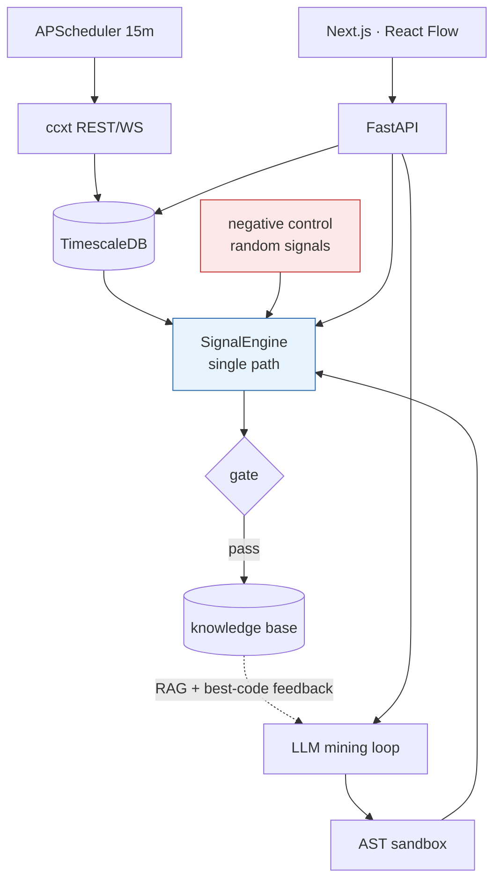
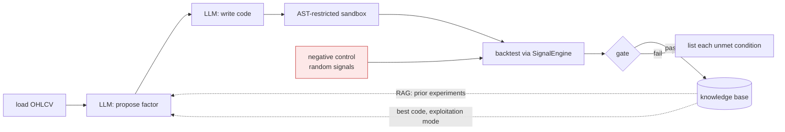

# Quant Research Platform

[← Portfolio index](../README.md) · [繁體中文版](03-quant-platform.zh-TW.md)

     

> A research platform packaged as a product: exchange ingestion, a node-graph strategy editor, a vectorised backtest, and an LLM factor-mining loop. I audited it against my own stricter research repository, concluded the mining loop was manufacturing false discoveries, then built an endpoint to measure exactly how often.

## 1. At a glance

| Item | Detail |
|---|---|
| **Type** | Full-stack research platform · FastAPI + Next.js, deployed |
| **Role** | Sole author |
| **Period** | 2026-02 (42 commits) · 2026-08 (38 commits, post-audit repairs) |
| **Size** | 87 Python + 43 TypeScript modules · ~26,800 LOC · 12 design docs (~2,400 lines) |
| **Headline result** | Old success gate passed **1 in 60** pure random signals; replacement gate **0 in 60** |
| **State** | Deployed behind Caddy with basic auth · 15-minute APScheduler cycle · 145/147 symbols at ≥95% coverage |
| **Source** | Private · read access can be arranged for hiring conversations |

## 2. Tech stack

| Layer | Technology |
|---|---|
| **Backend** | Python · FastAPI · SQLAlchemy 2.0 async · Alembic · `pydantic-settings` · `tenacity` · `httpx` |
| **Data** | TimescaleDB (PostgreSQL) · Redis (`redis[hiredis]`) · `ccxt` ≥4.4 REST + WebSocket · `pgvector` |
| **ML** | `scikit-learn` ≥1.6 · `lightgbm` ≥4.5 (top-20 feature selection + regression) · `joblib` |
| **Analysis** | `pandas` ≥2.2 · `numpy` ≥2.0 · `pandas-ta` · `mplfinance` |
| **Research safety** | AST-restricted sandbox for model-written code · rolling-window signal evaluation · negative control with turnover matching |
| **Scheduling** | `apscheduler`, 15-minute cycle |
| **Frontend** | Next.js · TypeScript · React Flow (node-graph editor) · lightweight-charts · ECharts |
| **Deployment** | Docker Compose · Caddy reverse proxy with basic auth · screen-managed services |

## 3. Architecture

```text
backend/app/
├── api/              routers, incl. research.py (mining loop + negative control)
├── services/
│   ├── signal_engine.py      the only path by which a signal is computed
│   ├── backtest_engine.py    vectorised backtest
│   ├── workflow_runner.py    topological DAG execution
│   ├── ml_pipeline.py        LightGBM / random forest training
│   ├── ml/feature_engineer.py  LightGBM top-20 feature selection
│   └── research/sandbox.py   AST-restricted execution of model-written code
├── models/ schemas/ core/
└── tests/            test_signal_engine.py — bar-by-bar equality
frontend/             Next.js, React Flow node editor, chart views
docs/                 12 design documents incl. a 722-line self-audit
```



## 4. What was built

| Mechanism | Built with | Problem it solves |
|---|---|---|
| **Single signal path** | `SignalEngine.backtest_series` / `live_signal`, frozen `ExecutionParams` dataclass | Two implementations disagreed on lookback (1020 vs 100 bars) and risk fraction (0.05 vs hardcoded 0.10), so **live exposure was double the backtest** |
| **Bar-by-bar equality test** | `live_signal(df.iloc[:k]) == backtest_series(df)[k-1]` | A look-ahead bug can pass a unit test on either path alone; it cannot survive an equality test between them |
| **AST-restricted sandbox** | Shared by backtest and live paths via `evaluate_last()` | A loop that has an LLM write code and then runs it has granted a remote model arbitrary execution |
| **Negative-control endpoint** | Random signals through the identical backtest and thresholds | Without it, nothing distinguishes a discovery from a coin flip |
| **Turnover-matched random baseline** | Geometric switch points, `target_trades` matched to the real factor | iid random signals have tens of times the turnover, so costs alone drive them to −100% and the luck line measures the cost model |
| **Trade-count-first success gate** | `≥100 trades · Sharpe > 0.8 · t > 2 · return > 0 · not liquidated`, per-condition failure reasons | A Sharpe from 5 trades has SE ≈ 0.46, and self-derived annualisation systematically prefers high turnover |
| **Invalid results not stored** | `valid=False` never written to the knowledge base | The loop feeds its best results back to the model and retrieves prior winners via RAG, so anything stored is amplified |
| **Execution parameters on the record** | `risk_pct`, `lookback`, `commission_rate`, `slippage_bps` as strategy columns | Constants in the monitor silently apply one strategy's assumptions to all of them |

## 5. Key implementation details

<details>
<summary><b>One signal path, proved equal bar by bar</b></summary>

Before the audit there were two implementations, and the docstring records exactly what they disagreed about:

```python
"""Crypto Quant Platform — 訊號引擎（回測與實盤的唯一計算路徑）

為什麼要有這一層（審查報告 P0-5）：

    改造前，同一份因子程式碼在兩邊跑出來的結果不一樣——
      研究時：`execute_factor_code_rolling(lookback=400)`，餵 1020 根
      實盤時：`test_factor_code(df)` single-pass，只餵 100 根
    EMA/RSI/ATR 的暖身值不同 → 實盤訊號與回測訊號本來就不會一樣，
    再加上風險比例一邊 0.05、一邊硬編 0.10，實盤曝險是回測的兩倍。

本模組保證：**同一份 code + 同一段資料 + 同一個 lookback → 同一個訊號**。
"""
DEFAULT_LOOKBACK = 400

@dataclass(frozen=True)
class ExecutionParams:
    """回測與實盤共用的執行參數（單一真實來源，不要在任何地方硬編）"""
```

Two lookbacks, 1020 bars against 100, gave EMA/RSI/ATR different warm-up state, so the two paths were never going to agree. On top of that the live risk fraction was hardcoded at `0.10` against a backtest using `0.05`: **live exposure was twice what the backtest measured**. `ExecutionParams` is a frozen dataclass precisely so there is one place for those numbers.

The guarantee is enforced by a test rather than by a convention:

```python
def test_live_signal_matches_backtest_series_bar_by_bar(price_df):
    bt = signal_engine.backtest_series(FACTOR_CODE, price_df, lookback=DEFAULT_LOOKBACK)
    series = bt["series"]

    # 只檢查暖身期之後的 bar（之前是不完整視窗，實盤本來就不該在那裡下單）
    for k in range(DEFAULT_LOOKBACK, len(price_df), 17):
        # 實盤：此刻只看得到前 k 根已收盤 K 棒
        live, err = signal_engine.live_signal(
            FACTOR_CODE, price_df.iloc[:k], lookback=DEFAULT_LOOKBACK
        )
        expected = int(series.iloc[k - 1])
        if live != expected:
            mismatches.append((k, live, expected))

    assert not mismatches
```

**`price_df.iloc[:k]` is the whole idea.** The live path is handed only the bars that had closed at that moment, and its answer must equal what the backtest produced for the same bar. A look-ahead bug can pass a unit test on either path alone; it cannot survive an equality test between them. The other tests in the file check that broken factor code returns flat rather than raising, that the signal is bounded to `{-1, 0, 1}`, and that changing the lookback actually changes the answer, which is what stops the parameter from being decorative.

</details>

<details>
<summary><b>The mining loop, and the two arrows that make it dangerous</b></summary>



The best result is fed back to the model for refinement, and prior winners are retrieved as examples to imitate. **Both dotted arrows amplify whatever the gate lets through**, so the gate is not a reporting threshold; it is the only thing between the loop and a self-reinforcing fiction.

The gate moved from `Sharpe > 0.8 and return > 0 and trades > 2` to `≥100 trades and Sharpe > 0.8 and t > 2 and return > 0 and not liquidated`, and failures now list **each unmet condition** rather than one number. A Sharpe computed from five trades has a standard error around 0.46 before annualisation, and the annualisation factor was derived from the sample's own turnover, so the old gate systematically preferred high turnover: the exact failure mode that killed most candidates in [P2](02-trading-engine.md) on costs.

</details>

<details>
<summary><b>Measuring the pipeline's own false-positive rate</b></summary>

The endpoint feeds **pure random signals** through the identical backtest and identical thresholds:

| Threshold | Random signals that passed |
|---|---|
| Old: `Sharpe > 0.8 · return > 0 · trades > 2` | **1 of 60 (2%)** |
| New: `+ trades ≥ 100 · t > 2 · not liquidated` | **0 of 60 (0%)** |

The false winner: **Sharpe 1.42, return +185%, 120 trades, t = 1.86.** Pure noise. The old gate would have written it into the knowledge base labelled "Confirmed Alpha", and the RAG layer would then have offered it to the model as an approach worth imitating.

**The first attempt at this measured nothing, and why is the interesting part:**

```python
def _random_signal() -> np.ndarray:
    if req.mode == "persistent":
        # 持續型隨機：切換點服從幾何分布，期望換手次數 = target_trades。
        # 這是唯一有比較價值的對照組——逐根 iid 的換手率是真因子的幾十倍，
        # 光成本就會把它打到 -100%，那條「運氣線」量不到任何東西。
        switch_p = min(1.0, req.target_trades / max(n, 1))
        switches = rng.random(n) < switch_p
        switches[0] = True
        idx = np.flatnonzero(switches)
        states = rng.choice([0, 1, -1], size=len(idx), p=probs)
        return states[np.searchsorted(idx, np.arange(n), side="right") - 1]
```

Per-bar iid random signals flip position every bar, so their turnover is tens of times a real factor's and transaction costs alone drive them to −100%: **30 trials, all −100%, mean Sharpe −6.9.** That is not a strict baseline, it is a broken one, and it was measuring the cost model rather than luck. The `persistent` mode places switch points on a geometric distribution so expected turnover equals `target_trades`, and the request field says why in the schema itself:

```python
target_trades: int = Field(
    200, ge=10, le=20000,
    description="持倉切換次數目標。**要與被比較的真因子換手率相當**，"
                "否則運氣線沒有比較價值（換手差一個量級，成本就差一個量級）",
)
# ⚠ 出場機制必須與挖礦當下用的一致，運氣線才有比較價值。
stop_atr_mult: Optional[float] = Field(2.0, description="None = 改用固定 SL/TP")
```

Turnover-matched, with the same ATR stop and trailing exit the mining loop uses, **40 trials give Sharpe mean −0.67, std 0.72, p95 +0.66, max +1.07.** Which yields the operating rule: a real factor that does not clearly exceed **+0.66** is a sampling extreme, not a discovery.

The 2% is a **floor**, not an estimate. It was measured on the new engine with next-bar-open fills, slippage and funding; the old engine filled at the same bar's close with neither, so its false-positive rate can only have been higher, and nothing measured it while it was running.

</details>

## 6. What the audit changed

| Area | Before | After |
|---|---|---|
| Signal computation | Two implementations disagreeing on lookback, risk fraction and bar limit | One `SignalEngine`, bar-by-bar equality test |
| Fill assumption | Same-bar close, no slippage, no funding | Next-bar-open, slippage, funding |
| Success gate | `Sharpe > 0.8 · return > 0 · trades > 2` | `≥100 trades · Sharpe > 0.8 · t > 2 · return > 0 · not liquidated`, per-condition reasons |
| Invalid results | Written to the knowledge base | Not stored |
| Look-ahead fallback | Single-pass path used when rolling failed | Deleted; the round is abandoned |
| Trustworthiness | Unmeasured | Negative-control endpoint with a published luck line |
| Execution parameters | Hardcoded in the live monitor | Columns on the strategy record |
| Data | 31-symbol OHLCV | Full USDT-M perpetual universe, 145/147 at ≥95% coverage |

## 7. Limitations

- **Still no out-of-sample split.** Designed and not built: mining confined to a training segment, one-shot validation on held-out data, and a freeze afterwards so a failed candidate cannot be re-tuned.
- **No DSR, PBO or CPCV.** [P2](02-trading-engine.md) has walk-forward but no multiple-comparison correction either, so there was nothing to port. Without a trial counter the platform cannot deflate for multiple comparisons, which means **0-of-60 says the gate rejects noise, not that anything passing it is real**.
- **"Confirmed Alpha" is still written by the model.** The gate is enforced in code; the label's text is not.
- **The factor space is single-symbol OHLCV**, which [P2](02-trading-engine.md) already showed to be too narrow. The cross-sectional panel and free exogenous fields are ingested but **not yet used by the mining loop**: the change most likely to matter, and not the one I made.
- **The ML pipeline's split and labelling are unaudited.** LightGBM feature selection and training run; whether the split leaks was flagged P1 and is unresolved. **No performance number from that pipeline is meaningful.**
- **Planning documents went stale.** `docs/06-implementation-phases.md` still lists Phase 2 and 3 as not started while both are substantially built. Design documents written first and then not maintained is a real cost of writing them up front.

In order: train/test split with one-shot OOS validation; a trial counter with DSR/PBO; move the label into code; then point the loop at the panel it already ingests.

## 8. Reference

| Item | Detail |
|---|---|
| **Backend** | Python, FastAPI, SQLAlchemy 2.0 async, Alembic, `pydantic-settings`, `tenacity`, `httpx` |
| **Data** | TimescaleDB, Redis (`redis[hiredis]`), `ccxt` ≥4.4 REST and WebSocket, `pgvector` |
| **Research** | AST-restricted sandbox for model-written factor code, rolling-window signal evaluation, negative control with geometric switch points and turnover matching |
| **ML** | `scikit-learn` ≥1.6, `lightgbm` ≥4.5 (top-20 feature selection and regression), `joblib` |
| **Analysis** | `pandas` ≥2.2, `numpy` ≥2.0, `pandas-ta`, `mplfinance`, `matplotlib` |
| **Scheduling** | `apscheduler`, 15-minute cycle |
| **Frontend** | Next.js, TypeScript, React Flow (node-graph editor), lightweight-charts, ECharts |
| **Deployment** | Docker Compose, Caddy reverse proxy with basic auth, screen-managed services; `/derivatives/coverage` reports per-symbol completeness (145/147 at ≥95%, median 99.9%) |
| **Ops detail** | The deploy script never uses broad process matching, because the host runs several unrelated long-lived services and a wildcard would kill them |

**Not in this document:** factor definitions, the strategies, mining prompt content, schema details, API routes, tuning constants, and the deployed URL.

**Availability.** The implementation is private. Read access can be arranged for hiring conversations.

---

[Portfolio index](../README.md)

---
