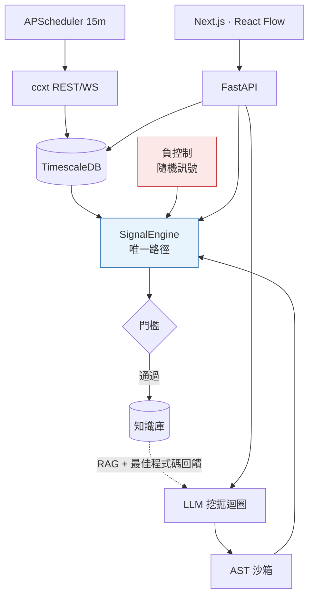
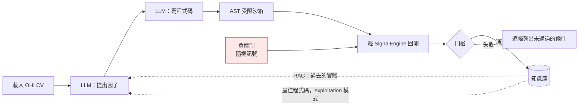

# 量化研究平台

[← 作品集索引](../README.zh-TW.md) · [English version](03-quant-platform.md)

     

> 一個做成產品形狀的研究平台：交易所擷取、節點圖策略編輯器、向量化回測，以及一個 LLM 因子挖掘迴圈。我拿自己更嚴格的研究 repo 審查它，結論是挖掘迴圈在製造假發現，然後做了一個端點來量它到底多常發生。

## 1. 專案綱要

| 項目 | 內容 |
|---|---|
| **類型** | 全端研究平台 · FastAPI + Next.js，已部署 |
| **角色** | 獨力完成 |
| **期間** | 2026-02（42 個 commit）· 2026-08（38 個 commit，審查後的修補） |
| **規模** | 87 個 Python + 43 個 TypeScript 模組 · 約 26,800 行 · 12 份設計文件（約 2,400 行） |
| **關鍵結果** | 舊的成功門檻讓 **60 次裡 1 次**純隨機訊號通過；換掉後 **0/60** |
| **狀態** | 部署在 Caddy 後帶 basic auth · 15 分鐘 APScheduler 週期 · 147 標的中 145 個覆蓋 ≥95% |
| **原始碼** | 私有 · 面談階段可安排讀取權限 |

## 2. 技術棧

| 層 | 技術 |
|---|---|
| **後端** | Python · FastAPI · SQLAlchemy 2.0 async · Alembic · `pydantic-settings` · `tenacity` · `httpx` |
| **資料** | TimescaleDB(PostgreSQL)· Redis(`redis[hiredis]`)· `ccxt` ≥4.4 REST + WebSocket · `pgvector` |
| **ML** | `scikit-learn` ≥1.6 · `lightgbm` ≥4.5（Top-20 特徵篩選 + 迴歸）· `joblib` |
| **分析** | `pandas` ≥2.2 · `numpy` ≥2.0 · `pandas-ta` · `mplfinance` |
| **研究安全** | 給模型寫的程式碼用的 AST 受限沙箱 · 滾動視窗訊號評估 · 對齊換手率的負控制 |
| **排程** | `apscheduler`,15 分鐘週期 |
| **前端** | Next.js · TypeScript · React Flow（節點圖編輯器）· lightweight-charts · ECharts |
| **部署** | Docker Compose · 帶 basic auth 的 Caddy 反向代理 · screen 管理的服務 |

## 3. 架構

```text
backend/app/
├── api/              routers，含 research.py（挖掘迴圈 + 負控制）
├── services/
│   ├── signal_engine.py      計算訊號的唯一路徑
│   ├── backtest_engine.py    向量化回測
│   ├── workflow_runner.py    拓撲排序 DAG 執行
│   ├── ml_pipeline.py        LightGBM / random forest 訓練
│   ├── ml/feature_engineer.py  LightGBM Top-20 特徵篩選
│   └── research/sandbox.py   模型產生程式碼的 AST 受限執行
├── models/ schemas/ core/
└── tests/            test_signal_engine.py — 逐根相等
frontend/             Next.js、React Flow 節點編輯器、圖表
docs/                 12 份設計文件，含一份 722 行的自我審查
```



## 4. 做了哪些事

| 做法 | 用什麼做 | 解決什麼問題 |
|---|---|---|
| **單一訊號路徑** | `SignalEngine.backtest_series` / `live_signal`,frozen `ExecutionParams` | 兩份實作在 lookback（1020 vs 100 根）與風險比例（0.05 vs 硬編 0.10）上不一致，**實盤曝險是回測的兩倍** |
| **逐根相等測試** | `live_signal(df.iloc[:k]) == backtest_series(df)[k-1]` | look-ahead 的 bug 可以單獨通過任一路徑的測試，但撐不過兩條路徑之間的相等測試 |
| **AST 受限沙箱** | 經 `evaluate_last()` 由回測與實盤共用 | 一個讓 LLM 寫程式碼然後執行的迴圈，等於把主機的任意執行權交給遠端模型 |
| **負控制端點** | 隨機訊號走完全相同的回測與門檻 | 沒有它，沒有任何東西能分辨一個發現與一次擲硬幣 |
| **對齊換手率的隨機基準** | 幾何分布切換點，`target_trades` 對齊真因子 | iid 隨機訊號換手率是幾十倍，光成本就打到 −100%，運氣線量到的是成本模型 |
| **先數交易筆數的成功門檻** | `≥100 筆 · Sharpe > 0.8 · t > 2 · 報酬 > 0 · 未爆倉`，逐條失敗理由 | 5 筆交易的 Sharpe 標準誤約 0.46，而自推的年化係數會系統性偏好高換手 |
| **無效結果不入庫** | `valid=False` 永不寫進知識庫 | 迴圈會把最佳結果餵回模型、並用 RAG 取回過去贏家，所以入庫的東西會被放大 |
| **執行參數放在策略記錄上** | `risk_pct`、`lookback`、`commission_rate`、`slippage_bps` 成為欄位 | 監控裡的常數會安靜地把某一個策略的假設套到全部策略 |

## 5. 關鍵實作細節

<details>
<summary><b>一條訊號路徑，逐根證明相等</b></summary>

審查之前有兩份實作，而那段 docstring 記下了它們到底差在哪：

```python
"""Crypto Quant Platform — 訊號引擎（回測與實盤的唯一計算路徑）

為什麼要有這一層（審查報告 P0-5）：

    改造前，同一份因子程式碼在兩邊跑出來的結果不一樣——
      研究時：`execute_factor_code_rolling(lookback=400)`，餵 1020 根
      實盤時：`test_factor_code(df)` single-pass，只餵 100 根
    EMA/RSI/ATR 的暖身值不同 → 實盤訊號與回測訊號本來就不會一樣，
    再加上風險比例一邊 0.05、一邊硬編 0.10，實盤曝險是回測的兩倍。

本模組保證：**同一份 code + 同一段資料 + 同一個 lookback → 同一個訊號**。
"""
DEFAULT_LOOKBACK = 400

@dataclass(frozen=True)
class ExecutionParams:
    """回測與實盤共用的執行參數（單一真實來源，不要在任何地方硬編）"""
```

兩個 lookback,1020 根對 100 根，讓 EMA/RSI/ATR 的暖身狀態不同，兩條路徑本來就不可能一致。再加上實盤的風險比例硬編成 `0.10`、回測用 `0.05`:**實盤曝險是回測所量測的兩倍**。`ExecutionParams` 是 frozen dataclass，正是為了讓那些數字只有一個地方。

那個保證由測試而不是約定來執行：

```python
def test_live_signal_matches_backtest_series_bar_by_bar(price_df):
    bt = signal_engine.backtest_series(FACTOR_CODE, price_df, lookback=DEFAULT_LOOKBACK)
    series = bt["series"]

    # 只檢查暖身期之後的 bar（之前是不完整視窗，實盤本來就不該在那裡下單）
    for k in range(DEFAULT_LOOKBACK, len(price_df), 17):
        # 實盤：此刻只看得到前 k 根已收盤 K 棒
        live, err = signal_engine.live_signal(
            FACTOR_CODE, price_df.iloc[:k], lookback=DEFAULT_LOOKBACK
        )
        expected = int(series.iloc[k - 1])
        if live != expected:
            mismatches.append((k, live, expected))

    assert not mismatches
```

**`price_df.iloc[:k]` 就是整個想法。** 實盤路徑只拿到那個當下已經收盤的 K 棒，而它的答案必須等於回測對同一根算出來的東西。一個 look-ahead 的 bug 可以單獨通過任一條路徑的單元測試，但它撐不過兩條路徑之間的相等測試。同一個檔案裡的其他測試檢查：壞掉的因子程式碼回傳平倉而不是拋例外、訊號被限制在 `{-1, 0, 1}`，以及改變 lookback 真的會改變答案。最後這一條是防止那個參數變成裝飾品。

</details>

<details>
<summary><b>挖掘迴圈，以及讓它危險的那兩條箭頭</b></summary>



最佳結果會被餵回模型去微調，而過去的贏家會被取回來當成值得模仿的範例。**兩條虛線箭頭都在放大門檻放過去的任何東西**，所以門檻不是一個回報用的閾值，它是唯一擋在迴圈與一套自我強化的虛構之間的東西。

門檻從 `Sharpe > 0.8 且 報酬 > 0 且 交易 > 2` 改成 `≥100 筆 且 Sharpe > 0.8 且 t > 2 且 報酬 > 0 且 未爆倉`，而失敗時會**逐條列出未通過的條件**而不是回一個數字。用五筆交易算出來的 Sharpe，年化之前的標準誤約 0.46，而年化係數是從樣本自身的換手率推得的，所以舊門檻系統性地偏好高換手：正是 [P2](02-trading-engine.zh-TW.md) 裡大多數候選死在成本上的那個死因。

</details>

<details>
<summary><b>量這條管線自己的假陽性率</b></summary>

那個端點把**純隨機訊號**餵進完全相同的回測與完全相同的門檻：

| 門檻 | 通過的隨機訊號 |
|---|---|
| 舊：`Sharpe > 0.8 · 報酬 > 0 · 交易 > 2` | **60 次裡 1 次（2%）** |
| 新：`+ 交易 ≥ 100 · t > 2 · 未爆倉` | **60 次裡 0 次（0%）** |

那個假贏家：**Sharpe 1.42、報酬 +185%、120 筆交易、t = 1.86。** 純雜訊。舊門檻會把它寫進知識庫、標成「Confirmed Alpha」，然後 RAG 層會把它當成值得模仿的做法拿給模型看。

**第一次嘗試什麼也沒量到，而原因才是有意思的部分：**

```python
def _random_signal() -> np.ndarray:
    if req.mode == "persistent":
        # 持續型隨機：切換點服從幾何分布，期望換手次數 = target_trades。
        # 這是唯一有比較價值的對照組——逐根 iid 的換手率是真因子的幾十倍，
        # 光成本就會把它打到 -100%，那條「運氣線」量不到任何東西。
        switch_p = min(1.0, req.target_trades / max(n, 1))
        switches = rng.random(n) < switch_p
        switches[0] = True
        idx = np.flatnonzero(switches)
        states = rng.choice([0, 1, -1], size=len(idx), p=probs)
        return states[np.searchsorted(idx, np.arange(n), side="right") - 1]
```

逐根 iid 的隨機訊號每根都翻倉，所以換手率是真因子的幾十倍，光交易成本就把它們打到 −100%:**30 次試驗全部 −100%，平均 Sharpe −6.9。** 那不是一條嚴格的基準，是一條壞掉的基準，而且它量到的是成本模型不是運氣。`persistent` 模式把切換點放在幾何分布上，讓期望換手等於 `target_trades`，而請求欄位的描述直接把理由寫在 schema 裡：

```python
target_trades: int = Field(
    200, ge=10, le=20000,
    description="持倉切換次數目標。**要與被比較的真因子換手率相當**，"
                "否則運氣線沒有比較價值（換手差一個量級，成本就差一個量級）",
)
# ⚠ 出場機制必須與挖礦當下用的一致，運氣線才有比較價值。
stop_atr_mult: Optional[float] = Field(2.0, description="None = 改用固定 SL/TP")
```

對齊換手率、並使用挖掘迴圈當下用的同一套 ATR 停損與追蹤出場，**40 次試驗給出 Sharpe 平均 −0.67、std 0.72、p95 +0.66、最大 +1.07。** 於是得到那條操作規則：一個沒有明顯超過 **+0.66** 的真因子，是取樣極值，不是發現。

那個 2% 是**下限**，不是估計值。它是在新引擎上量的，含次根開盤成交、滑價與資金費；舊引擎用同根收盤成交、兩者都沒有，所以它的假陽性率只可能更高，而它運行的那段期間沒有任何東西在量它。

</details>

## 6. 那次審查改了什麼

| 面向 | 之前 | 之後 |
|---|---|---|
| 訊號計算 | 兩份實作，lookback、風險比例、資料筆數上限都不一致 | 一個 `SignalEngine`，逐根相等測試 |
| 成交假設 | 同根收盤、無滑價、無資金費 | 次根開盤、滑價、資金費 |
| 成功門檻 | `Sharpe > 0.8 · 報酬 > 0 · 交易 > 2` | `≥100 筆 · Sharpe > 0.8 · t > 2 · 報酬 > 0 · 未爆倉`，逐條理由 |
| 無效結果 | 寫進知識庫 | 不儲存 |
| look-ahead 退路 | rolling 失敗時走 single-pass | 刪除；改成放棄該輪 |
| 可信度 | 未量測 | 負控制端點，並公布運氣線 |
| 執行參數 | 硬編在實盤監控裡 | 策略記錄上的欄位 |
| 資料 | 31 個標的的 OHLCV | 全 USDT-M 永續標的池，147 個裡 145 個覆蓋 ≥95% |

## 7. 限制

- **仍然沒有樣本外切分。** 已設計但沒做：挖掘限制在訓練段、在保留資料上做一次性驗證、驗過就凍結，讓失敗的候選不能再調。
- **沒有 DSR、PBO 或 CPCV。** [P2](02-trading-engine.zh-TW.md) 有 walk-forward，但同樣沒有多重比較校正，所以也沒有東西可以移植。沒有試驗次數計數器，平台就無法對多重比較做扣減，也就是說 **0/60 說的是門檻擋掉了雜訊，不是說通過它的東西就是真的**。
- **「Confirmed Alpha」仍然是模型寫的。** 門檻在程式碼裡強制，標籤的文字不是。
- **因子空間是單幣 OHLCV**，而 [P2](02-trading-engine.zh-TW.md) 早就證明它太窄。橫斷面 panel 與免費的外生欄位已經在擷取，**但挖掘迴圈還沒有用它**：那是最可能有影響的改動，也不是我做的那一個。
- **ML pipeline 的切分與標籤未經審查。** LightGBM 的特徵篩選與訓練會跑；切分是否洩漏被標為 P1 且尚未解決。**那條 pipeline 產出的任何績效數字都沒有意義。**
- **規劃文件過期了。** `docs/06-implementation-phases.md` 到現在還把 Phase 2 與 3 列為未開始，而兩者都已大致建好。先寫設計文件然後不維護，是「事先寫設計文件」的真實代價。

依序：train/test 切分加一次性 OOS 驗證；試驗次數計數器與 DSR/PBO；把標籤移進程式碼；然後把迴圈指向它已經在擷取的 panel。

## 8. 參考

| 項目 | 內容 |
|---|---|
| **後端** | Python、FastAPI、SQLAlchemy 2.0 async、Alembic、`pydantic-settings`、`tenacity`、`httpx` |
| **資料** | TimescaleDB、Redis（`redis[hiredis]`）、`ccxt` ≥4.4 REST 與 WebSocket、`pgvector` |
| **研究** | 給模型寫的因子程式碼用的 AST 受限沙箱、滾動視窗訊號評估、以幾何切換點與換手率對齊的負控制 |
| **ML** | `scikit-learn` ≥1.6、`lightgbm` ≥4.5（Top-20 特徵篩選與迴歸）、`joblib` |
| **分析** | `pandas` ≥2.2、`numpy` ≥2.0、`pandas-ta`、`mplfinance`、`matplotlib` |
| **排程** | `apscheduler`,15 分鐘週期 |
| **前端** | Next.js、TypeScript、React Flow（節點圖編輯器）、lightweight-charts、ECharts |
| **部署** | Docker Compose、帶 basic auth 的 Caddy 反向代理、screen 管理的服務；`/derivatives/coverage` 回報逐標的完整度（147 個裡 145 個 ≥95%、中位數 99.9%） |
| **維運細節** | 部署腳本從不使用模糊的行程比對，因為這台主機跑著好幾個不相關的常駐服務，一個萬用字元會殺掉它們 |

**不在本文件內：** 因子定義、策略本身、挖掘 prompt 內容、schema 細節、API 路由、調校常數，以及部署的網址。

**取得方式。** 實作是私有的。面談階段可以安排讀取權限。

---

[作品集索引](../README.zh-TW.md)

---
