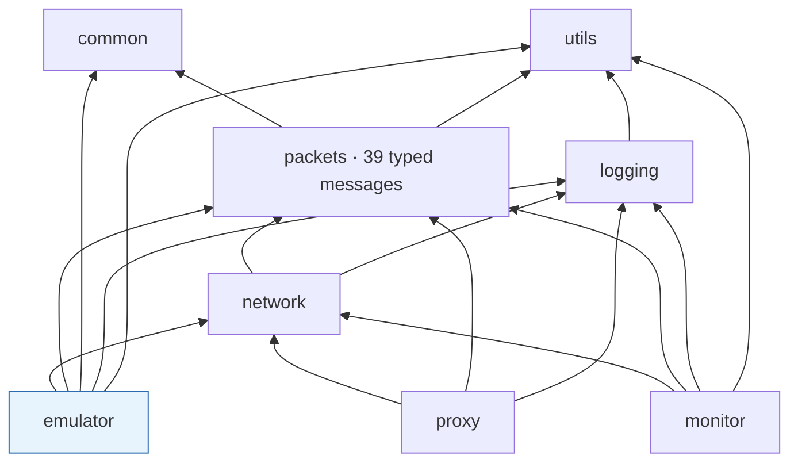
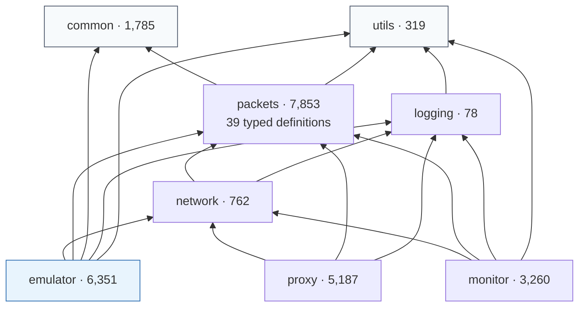

# Game Server Emulator

[← Portfolio index](../README.md) · [繁體中文版](04-server-emulator.zh-TW.md)

    

> A .NET 10 server on the Generic Host: three `BackgroundService` roles sharing one DI container, reflection-registered message handlers, and a hand-written framing layer over raw `Socket`. Twelve projects, and the layout's load-bearing property is that three independent executables share one message layer.

## 1. At a glance

| Item | Detail |
|---|---|
| **Type** | Multi-role network server · 12-project .NET solution |
| **Role** | Sole author |
| **Period** | 2026-03 to 2026-05 · 100 commits |
| **Size** | 202 C# files · ~40,700 LOC total, of which the **server is 6,351 (16%)** and tooling is 23,034 (57%) |
| **Surface** | 39 typed message definitions · 28 handlers · 1,240-line dispatch map |
| **State** | Dispatch complete; gameplay resolution deliberately stubbed |
| **Source** | Private · read access can be arranged for hiring conversations |

## 2. Tech stack

| Layer | Technology |
|---|---|
| **Runtime** | .NET 10 · `ImplicitUsings` · `Nullable` enabled solution-wide |
| **Hosting** | `Microsoft.Extensions.Hosting` 9.0.3 · `Host.CreateDefaultBuilder` · `BackgroundService` |
| **Configuration** | Options pattern bound to `appsettings.json` via `IOptions<T>` |
| **DI** | `Microsoft.Extensions.DependencyInjection` · singleton lifetimes · concrete-plus-hosted double registration |
| **Networking** | `System.Net.Sockets.Socket` (not `TcpListener`) · `AcceptAsync(CancellationToken)` · backlog 65,535 |
| **Framing** | `System.Buffers.Binary.BinaryPrimitives` over `Span<byte>` · length-prefixed · stream reassembly |
| **Serialisation** | `BinaryReader` subclass adding big-endian readers · per-message parse/serialise · null on malformed input |
| **Dispatch** | Custom `Attribute` · `Assembly.GetTypes()` scan · `Activator.CreateInstance` · dictionary by message type |
| **Persistence** | `IAccountRepository` → `JsonDB` (folder per account, JSON per character) · `ISessionManager` → in-memory |
| **Static data** | CSV linked via `.csproj` `None Include` + `CopyToOutputDirectory=PreserveNewest` |
| **Testing** | NUnit 4.3.2 · `Microsoft.NET.Test.Sdk` 17.14.0 · `coverlet.collector` |

## 3. Architecture

```text
solution  (12 projects)
├── utils          319     no dependencies
├── common       1,785     no dependencies — 1,240-line dispatch map, CSV, enums
├── logging         78  →  utils
├── packets      7,853  →  common, utils      39 typed definitions, zero NuGet packages
├── network        762  →  packets, logging   Socket, framing
├── emulator     6,351  →  network, packets, common, logging, utils
├── monitor      3,260  →  network, packets, logging, utils
├── proxy        5,187  →  network, packets, logging
├── tests          519  →  packets, utils
└── tools/       ...     13,195 + 921 + 471
```



**Three independent executables sit at the same level on one message layer.** Putting those definitions inside the server would force the other two to duplicate them, and a duplicated definition drifts: two programs disagree about the same bytes while both compile.

## 4. What was built

| Mechanism | Built with | Problem it solves |
|---|---|---|
| **Three server roles on one abstract base** | 79-line base over `SocketServer` + three 28-line roles | Roles become configuration points rather than implementations; shared registry and broadcast live once |
| **Concrete-plus-hosted double registration** | `AddSingleton<T>()` then `AddHostedService(sp => sp.GetRequiredService<T>())` | `AddHostedService<T>()` alone registers something nothing else can reach, so the operator console could not inspect a live server |
| **Typed configuration** | Options pattern, `IOptions<ServerConfig>` | Ports and server-list entries stop being string lookups |
| **Swappable repository** | `IAccountRepository` interface, `JsonDB` implementation | Storage can move to MySQL/PostgreSQL without touching callers |
| **Attribute-scan handler registration** | Custom `Attribute` + assembly scan + `Activator.CreateInstance` | A registration table is a checklist, and 28 handlers means 28 chances to forget |
| **Big-endian `BinaryReader` subclass** | `ReadUInt32BE()` etc. over `Array.Reverse` | The BCL reader is little-endian by contract; a missed byte swap produces a plausible wrong number, not an exception |
| **Span-based framing with reassembly** | `BinaryPrimitives.ReadUInt16BigEndian(buffer.AsSpan()...)` in a consume loop | TCP is a stream: one read can hold several messages or half of one |
| **Static data as a build input** | `.csproj` `None Include` + `Link` + `PreserveNewest`, 9 CSV groups | A missing file becomes a visible build-output problem instead of a null at first use |
| **In-process operator console** | Hosted service reaching the same connection abstraction handlers receive | Change→rebuild→restart→log in→navigate is minutes per hypothesis |

## 5. Key implementation details

<details>
<summary><b>Composition root: everything is constructor-injected except one thing</b></summary>

`Program.cs` is top-level statements ending in `await host.RunAsync()`. The whole server is wired in one `ConfigureServices` block:

```csharp
services.Configure<ServerConfig>(ctx.Configuration.GetSection(ServerConfig.SectionName));
services.Configure<ServerListConfig>(ctx.Configuration.GetSection(ServerListConfig.SectionName));

services.AddSingleton<IMapManager, MapManager>();
services.AddSingleton<ISessionManager, LocalMemorySessionManager>();
services.AddSingleton<IAccountRepository, JsonDB>();   // swappable for MySQL/PostgreSQL

services.AddSingleton<LoginServerHostedService>();
services.AddSingleton<LobbyServerHostedService>();
services.AddSingleton<WorldServerHostedService>();

services.AddHostedService(sp => sp.GetRequiredService<LoginServerHostedService>());
services.AddHostedService(sp => sp.GetRequiredService<LobbyServerHostedService>());
services.AddHostedService(sp => sp.GetRequiredService<WorldServerHostedService>());

services.AddHostedService<InteractiveConsoleService>();
```

**The double registration on the three servers is deliberate.** `AddHostedService<T>()` alone registers a hosted service that nothing else can reach, so the interactive console could not inspect a live server. Registering the concrete type as a singleton first and then resolving *that instance* into the hosted-service slot means both roles share one object: the host owns its lifetime, and the console gets a reference to the same running server.

Each server takes its dependencies through the constructor:

```csharp
public sealed class LoginServerHostedService : ServerHostedService
{
    public LoginServerHostedService(
        IOptions<ServerConfig> config,
        IOptions<ServerListConfig> serverListConfig,
        ISessionManager sessionManager,
        IAccountRepository repository,
        IMapManager mapManager)
        : base(new LoginServer(config.Value.Login, serverListConfig.Value,
                               sessionManager, repository, mapManager)) { }
}
```

`Options` binds `appsettings.json` to typed objects, so ports and server-list entries are not string lookups. `IAccountRepository` is an interface with a `JsonDB` implementation storing one folder per account (`_account.json` plus one file per character), documented as replaceable without touching callers.

**The advantage is ordinary and worth stating plainly:** three servers share one `ISessionManager` instance because the container guarantees it, not because a static field happens to be reachable. `BackgroundService.ExecuteAsync(CancellationToken)` then gives graceful shutdown for free, which the accept loop below actually uses.

**The exception is handlers**, and the dispatch section below explains why.

</details>

<details>
<summary><b>Dispatch by attribute scan, and the hole it puts in the composition root</b></summary>

Handlers are found by reflection at startup rather than listed in a table:

```csharp
public static void LoadPacketHandlers(string namespaceName)
{
    var classes = from t in Assembly.GetCallingAssembly().GetTypes()
                  where t.IsClass && t.Namespace == namespaceName
                        && t.IsSubclassOf(typeof(ClientPacketHandler))
                  select t;

    foreach (var t in classes.ToList())
    {
        var attrs = (Attribute[])t.GetCustomAttributes(typeof(ClientPacketHandlerAttr), false);
        if (attrs.Length > 0)
        {
            var attr = (ClientPacketHandlerAttr)attrs[0];
            if (!Handlers.ContainsKey(attr.packetId))
                Handlers.Add(attr.packetId, (ClientPacketHandler)Activator.CreateInstance(t));
        }
    }
}
```

A handler is then just a class with an attribute:

```csharp
[ClientPacketHandlerAttr(PacketType.Attack)]
public class AttackEnemyHandler : ClientPacketHandler
{
    public override async Task HandlePacketAsync(IPlayerClient client, RawPacket p) { ... }
}
```

**What it buys:** adding a handler is adding a file. There is no registration list to forget, which is the same failure mode as a checklist, and 28 handlers means 28 chances to forget.

**What it costs, precisely:** `Activator.CreateInstance(t)` takes no arguments, so **handlers are the one part of this server that cannot be constructor-injected**. Everything in the composition root gets its collaborators through the container; a handler reaches them through the `IPlayerClient` parameter or through static state. Handlers are also singletons, one instance created at load and reused for every message, so they cannot hold state either.

And `if (!Handlers.ContainsKey(...))` means a duplicated attribute keeps whichever type reflection happened to return first and drops the second **without a message**. A handler outside the scanned namespace is never registered at all. Both are startup-time silences rather than compile errors, and validating the registration set at startup is the first item in §6.

</details>

<details>
<summary><b>Transport: raw <code>Socket</code>, <code>Span&lt;byte&gt;</code>, and a big-endian <code>BinaryReader</code></b></summary>

The accept loop uses `Socket` directly rather than `TcpListener`, and takes the host's cancellation token:

```csharp
_server = new Socket(AddressFamily.InterNetwork, SocketType.Stream, ProtocolType.Tcp);
_server.Bind(new IPEndPoint(IPAddress.Parse(_host), _port));
_server.Listen(0xFFFF);

while (!token.IsCancellationRequested)
{
    var sock = await _server.AcceptAsync(token);
    OnConnect(new SocketClient(sock));
}
```

`OperationCanceledException` is caught and **not logged as an error**, because Ctrl+C and host shutdown both arrive that way and a shutdown path that prints a stack trace trains you to ignore stack traces.

Framing reads a length prefix off the front of the buffer with `System.Buffers.Binary`:

```csharp
ushort length = BinaryPrimitives.ReadUInt16BigEndian(buffer.AsSpan().Slice(1, 2));
```

`BinaryPrimitives` plus `Span<byte>` reads the prefix without allocating and without a manual byte swap. The loop around it keeps consuming while a complete frame remains, because TCP delivers a stream and one read can contain several messages or half of one.

The wire format is big-endian and **`BinaryReader` is little-endian by contract**, so rather than reversing bytes at every call site there is a subclass:

```csharp
public class PacketReader : BinaryReader
{
    public PacketReader(byte[] input) : base(new MemoryStream(input)) { }

    public ulong ReadUInt64BE()
    {
        var bytes = ReadBytes(8);
        if (bytes.Length < 8) throw new EndOfStreamException();
        Array.Reverse(bytes);
        return BitConverter.ToUInt64(bytes, 0);
    }
    // ReadInt64BE, ReadUInt32BE, ReadInt32BE, ReadUInt16BE ...
}
```

**The advantage is that endianness stops being a thing anyone has to remember.** A message definition calls `ReadUInt32BE()` and cannot silently get it wrong; the alternative, `IPAddress.NetworkToHostOrder` or a manual reverse at each field, is 39 definitions' worth of opportunities to miss one, and a missed byte swap produces a plausible wrong number rather than an exception.

</details>

<details>
<summary><b>Static data is a build-time pipeline, not a loader</b></summary>

Reference tables live as CSV in a shared `Resource/` folder and are linked into the output by the project file:

```xml
<None Include="..\Resource\items\equipment.csv">
  <Link>Data\items\equipment.csv</Link>
  <CopyToOutputDirectory>PreserveNewest</CopyToOutputDirectory>
</None>
<None Include="..\Resource\Maps\*.csv">
  <Link>Data\Maps\%(Filename)%(Extension)</Link>
  <CopyToOutputDirectory>PreserveNewest</CopyToOutputDirectory>
</None>
```

Nine such groups cover actions, monsters, monster combat stats, equipment, usable items, maps, map spawn and portal tables, NPC and shop definitions, and an effect-slot mapping, plus binary collision files kept in their original format. They are produced by the tooling projects and by observation, then consumed here.

**The advantage over a loader that reads from a content directory:** the data is a build input, so a missing file is a build-output problem visible on disk rather than a null at first use, and `PreserveNewest` means editing a CSV does not require a rebuild of the code. The tables are loaded once into singleton registries and shared read-only across all three servers.

The cost is that the read-only part is a convention. Nothing enforces it, and a consumer mutating a shared table would compile.

</details>

<details>
<summary><b>Layout: twelve projects, two of which depend on nothing</b></summary>



`emulator`, `monitor` and `proxy` are three separate executables at the same level, none referencing the others, all reading the same 39 typed message definitions. `packets` has **zero package references**: it is pure BCL, which is what lets three unrelated consumers take it without inheriting a dependency tree.

Putting those definitions inside the server would force the other two to duplicate them, and a duplicated definition drifts: two programs disagree about the same bytes while both compile.

| Inside the server | Lines |
|---|---|
| Per-connection object | 756 |
| 28 handlers | 2,567 |
| Static data registries | 1,287 |
| Services: operator console, test message builder | 801 |
| Models | 341 |
| Persistence (`JsonDB` + session manager) | 169 |
| Session record | **9** |

**The session record is nine lines** and persistence is 169. Neither is an architecture, and one of only two services is test scaffolding.

</details>

## 6. Limitations

- **No startup validation of the handler registry** (dispatch by attribute scan). A duplicate or misplaced attribute is a silent no-op. One hour of work, first on the list.
- **No test for dispatch.** The test project is NUnit 4 with `coverlet.collector` wired up, and it covers message serialisation only, so a handler bound to the wrong identifier would not fail a build.
- **Handlers cannot be constructor-injected** (dispatch by attribute scan), which is the single inconsistency in an otherwise container-driven design.
- **Gameplay resolution is stubbed.** The combat handler applies a fixed damage constant and carries a numbered list of the formulas that would replace it, annotated on the line that produces the wrong number. Dispatch is complete; resolution is not, and **no behaviour here should be described as a game implementation**.
- **`JsonDB` has no migrations and no durability testing.** It is a working implementation of the repository interface, not a data layer.

In order: validate the registry at startup, test dispatch, then replace `Activator.CreateInstance` with the container that is already there, which removes that hole and makes the first two easier to keep.

## 7. Reference

| Item | Detail |
|---|---|
| **Runtime** | .NET 10, `ImplicitUsings`, `Nullable` enabled |
| **Hosting** | `Microsoft.Extensions.Hosting` 9.0.3 · `Host.CreateDefaultBuilder` · `BackgroundService` · Options pattern bound to `appsettings.json` |
| **DI** | `Microsoft.Extensions.DependencyInjection`, singleton lifetimes, concrete-plus-hosted double registration |
| **Networking** | `System.Net.Sockets.Socket`, `AcceptAsync(CancellationToken)`, backlog 65,535, `System.Buffers.Binary.BinaryPrimitives` over `Span<byte>`, length-prefixed framing with stream reassembly |
| **Serialisation** | `BinaryReader` subclass adding big-endian readers, per-message parse and serialise, null on malformed input |
| **Dispatch** | Custom `Attribute`, `Assembly.GetTypes()` scan, `Activator.CreateInstance`, dictionary keyed by message type |
| **Persistence** | `IAccountRepository` → `JsonDB` (folder per account, JSON per character), `ISessionManager` → in-memory |
| **Static data** | CSV linked via `.csproj` `None Include` + `CopyToOutputDirectory=PreserveNewest`, loaded into singleton registries |
| **Testing** | NUnit 4.3.2, `Microsoft.NET.Test.Sdk` 17.14.0, `coverlet.collector` |
| **Line distribution** | Tooling 23,034 (57%) · messages 7,853 (19%) · **server 6,351 (16%)** · `common` 1,785 · transport 762 · tests, utils, logging 916 |

**Not in this document:** message layouts and identifier values, framing constants, the contents of the type map, and the five tool projects. Type names that would identify the client are lightly renamed in the excerpts above; everything else is quoted as written.

**Availability.** The implementation is private. Read access can be arranged for hiring conversations.

---

[Portfolio index](../README.md)

---
