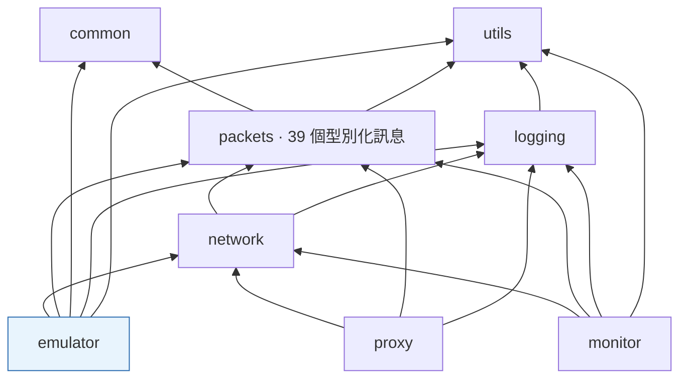
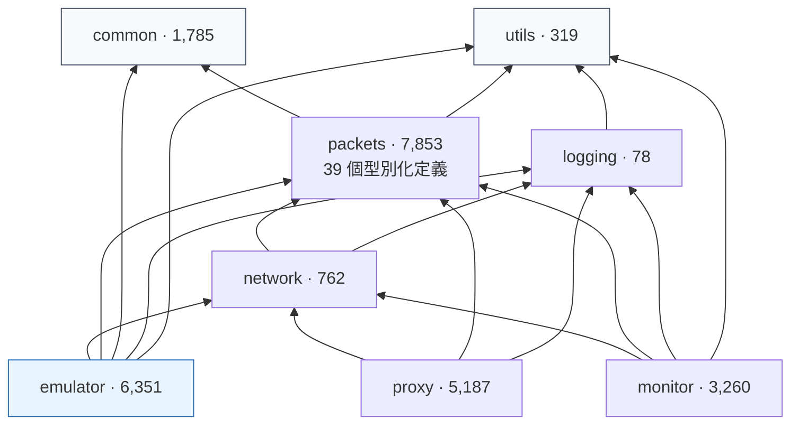

# 遊戲伺服器模擬

[← 作品集索引](../README.zh-TW.md) · [English version](04-server-emulator.md)

    

> 一個建在 .NET 10 Generic Host 上的伺服器：三個 `BackgroundService` 角色共用同一個 DI 容器、以反射註冊的訊息 handler，以及一層跑在裸 `Socket` 上的手寫 framing。12 個專案，而這個佈局真正承重的地方是：三個獨立的執行檔共用同一個訊息層。

## 1. 專案綱要

| 項目 | 內容 |
|---|---|
| **類型** | 多角色網路伺服器 · 12 專案 .NET solution |
| **角色** | 獨力完成 |
| **期間** | 2026-03 至 2026-05 · 100 個 commit |
| **規模** | 202 個 C# 檔 · 全體約 40,700 行，其中**伺服器 6,351 行（16%）**、工具 23,034 行（57%） |
| **介面規模** | 39 個型別化訊息定義 · 28 個 handler · 1,240 行派送對應表 |
| **狀態** | 派送完整；戰鬥結算刻意留樁 |
| **原始碼** | 私有 · 面談階段可安排讀取權限 |

## 2. 技術棧

| 層 | 技術 |
|---|---|
| **執行環境** | .NET 10 · `ImplicitUsings` · 全 solution 啟用 `Nullable` |
| **託管** | `Microsoft.Extensions.Hosting` 9.0.3 · `Host.CreateDefaultBuilder` · `BackgroundService` |
| **設定** | Options pattern，經 `IOptions<T>` 綁定 `appsettings.json` |
| **DI** | `Microsoft.Extensions.DependencyInjection` · singleton 生命週期 · 具體型別加 hosted service 的雙重註冊 |
| **網路** | `System.Net.Sockets.Socket`（非 `TcpListener`）· `AcceptAsync(CancellationToken)` · backlog 65,535 |
| **Framing** | `System.Buffers.Binary.BinaryPrimitives` 搭 `Span<byte>` · 長度前綴 · 串流重組 |
| **序列化** | `BinaryReader` 子類別加上大端序讀取 · 逐訊息 parse/serialise · 輸入壞掉回傳 null |
| **派送** | 自訂 `Attribute` · `Assembly.GetTypes()` 掃描 · `Activator.CreateInstance` · 以訊息型別為鍵的字典 |
| **持久化** | `IAccountRepository` → `JsonDB`（一帳號一資料夾、一角色一 JSON）· `ISessionManager` → 記憶體內 |
| **靜態資料** | CSV 經 `.csproj` 的 `None Include` + `CopyToOutputDirectory=PreserveNewest` 連結 |
| **測試** | NUnit 4.3.2 · `Microsoft.NET.Test.Sdk` 17.14.0 · `coverlet.collector` |

## 3. 架構

```text
solution（12 個專案）
├── utils          319     無依賴
├── common       1,785     無依賴 — 1,240 行派送對應表、CSV、enum
├── logging         78  →  utils
├── packets      7,853  →  common, utils      39 個型別化定義，零 NuGet 套件
├── network        762  →  packets, logging   Socket、framing
├── emulator     6,351  →  network, packets, common, logging, utils
├── monitor      3,260  →  network, packets, logging, utils
├── proxy        5,187  →  network, packets, logging
├── tests          519  →  packets, utils
└── tools/       ...     13,195 + 921 + 471
```



**三個獨立執行檔在同一層、共用一個訊息層。** 把那些定義放進伺服器，會逼另外兩個去複製它，而複製過的定義會漂移：兩個程式對同一段位元組的理解不一致，但兩邊都編譯得過。

## 4. 做了哪些事

| 做法 | 用什麼做 | 解決什麼問題 |
|---|---|---|
| **一個抽象基底上的三個伺服器角色** | 79 行基底擴充 `SocketServer` + 三個 28 行角色 | 角色變成設定點而不是實作；共用的連線登錄與 broadcast 只存在一次 |
| **具體型別加 hosted service 的雙重註冊** | `AddSingleton<T>()` 再 `AddHostedService(sp => sp.GetRequiredService<T>())` | 只用 `AddHostedService<T>()` 註冊出來的東西別的地方拿不到，主控台就無法檢視運行中的伺服器 |
| **型別安全的設定** | Options pattern、`IOptions<ServerConfig>` | 連接埠與伺服器清單不再是字串查表 |
| **可替換的 repository** | `IAccountRepository` 介面、`JsonDB` 實作 | 儲存層可以換成 MySQL/PostgreSQL 而不動呼叫端 |
| **屬性掃描的 handler 註冊** | 自訂 `Attribute` + assembly 掃描 + `Activator.CreateInstance` | 一張註冊表就是一份檢查清單，而 28 個 handler 就是 28 次忘記的機會 |
| **大端序的 `BinaryReader` 子類別** | `ReadUInt32BE()` 等，內部用 `Array.Reverse` | BCL 的 reader 契約上是小端序；漏一次翻轉產出的是合理但錯誤的數字，不是例外 |
| **以 Span 為基礎的 framing 與重組** | `BinaryPrimitives.ReadUInt16BigEndian(buffer.AsSpan()...)` 放在消費迴圈裡 | TCP 是串流：一次讀取可能含好幾個訊息，也可能只有半個 |
| **靜態資料當成 build 輸入** | `.csproj` 的 `None Include` + `Link` + `PreserveNewest`,9 組 CSV | 缺檔變成磁碟上看得見的 build 問題，而不是第一次使用時的 null |
| **行程內維運主控台** | Hosted service，取用 handler 收到的同一個連線抽象 | 改碼→重建→重啟→登入→走到情境，是每個假說好幾分鐘 |

## 5. 關鍵實作細節

<details>
<summary><b>Composition root：除了一個地方，全部都是建構子注入</b></summary>

`Program.cs` 是 top-level statements，結尾是 `await host.RunAsync()`。整個伺服器在一個 `ConfigureServices` 區塊裡接起來：

```csharp
services.Configure<ServerConfig>(ctx.Configuration.GetSection(ServerConfig.SectionName));
services.Configure<ServerListConfig>(ctx.Configuration.GetSection(ServerListConfig.SectionName));

services.AddSingleton<IMapManager, MapManager>();
services.AddSingleton<ISessionManager, LocalMemorySessionManager>();
services.AddSingleton<IAccountRepository, JsonDB>();   // 可換成 MySQL/PostgreSQL

services.AddSingleton<LoginServerHostedService>();
services.AddSingleton<LobbyServerHostedService>();
services.AddSingleton<WorldServerHostedService>();

services.AddHostedService(sp => sp.GetRequiredService<LoginServerHostedService>());
services.AddHostedService(sp => sp.GetRequiredService<LobbyServerHostedService>());
services.AddHostedService(sp => sp.GetRequiredService<WorldServerHostedService>());

services.AddHostedService<InteractiveConsoleService>();
```

**三個伺服器被註冊兩次是刻意的。** 只用 `AddHostedService<T>()` 註冊出來的 hosted service，其他東西拿不到它，那樣互動主控台就無法檢視一個運行中的伺服器。先把具體型別註冊成 singleton、再把**那個實例**解析進 hosted service 的位置，兩個角色就共用同一個物件：生命週期歸 host 管，而主控台拿到的是同一個正在跑的伺服器。

每個伺服器的依賴都走建構子：

```csharp
public sealed class LoginServerHostedService : ServerHostedService
{
    public LoginServerHostedService(
        IOptions<ServerConfig> config,
        IOptions<ServerListConfig> serverListConfig,
        ISessionManager sessionManager,
        IAccountRepository repository,
        IMapManager mapManager)
        : base(new LoginServer(config.Value.Login, serverListConfig.Value,
                               sessionManager, repository, mapManager)) { }
}
```

Options 把 `appsettings.json` 綁成型別安全的物件，所以連接埠與伺服器清單不是字串查表。`IAccountRepository` 是介面，實作是 `JsonDB`：一個帳號一個資料夾（`_account.json` 加上每個角色一個檔）並在註解裡寫明可以替換而不動呼叫端。

**好處很平常，但值得直說：** 三個伺服器共用同一個 `ISessionManager` 實例，是因為容器保證了這件事，不是因為剛好有個靜態欄位拿得到。而 `BackgroundService.ExecuteAsync(CancellationToken)` 免費給了優雅關閉，下面那段的 accept 迴圈實際上用到了它。

**例外是 handler**，而下一段講的就是為什麼。

</details>

<details>
<summary><b>用屬性掃描做派送，以及它在 Composition root 上開的那個洞</b></summary>

Handler 是啟動時用反射找出來的，不是列在一張表上：

```csharp
public static void LoadPacketHandlers(string namespaceName)
{
    var classes = from t in Assembly.GetCallingAssembly().GetTypes()
                  where t.IsClass && t.Namespace == namespaceName
                        && t.IsSubclassOf(typeof(ClientPacketHandler))
                  select t;

    foreach (var t in classes.ToList())
    {
        var attrs = (Attribute[])t.GetCustomAttributes(typeof(ClientPacketHandlerAttr), false);
        if (attrs.Length > 0)
        {
            var attr = (ClientPacketHandlerAttr)attrs[0];
            if (!Handlers.ContainsKey(attr.packetId))
                Handlers.Add(attr.packetId, (ClientPacketHandler)Activator.CreateInstance(t));
        }
    }
}
```

於是一個 handler 就只是一個帶屬性的類別：

```csharp
[ClientPacketHandlerAttr(PacketType.Attack)]
public class AttackEnemyHandler : ClientPacketHandler
{
    public override async Task HandlePacketAsync(IPlayerClient client, RawPacket p) { ... }
}
```

**換到什麼：** 新增一個 handler 就是新增一個檔案。沒有一張會被忘記更新的註冊清單，而「會被忘記」跟檢查清單是同一種失效模式；28 個 handler 就是 28 次忘記的機會。

**精確地說付出什麼：** `Activator.CreateInstance(t)` 不吃參數，所以 **handler 是這個伺服器裡唯一無法用建構子注入的部分**。Composition root 裡所有東西都從容器拿到協作者；handler 只能透過 `IPlayerClient` 參數或靜態狀態拿。它們同時也是單例，載入時建一個、之後每個訊息重複使用，所以也不能持有狀態。

而 `if (!Handlers.ContainsKey(...))` 意味著屬性重複時，反射先回傳哪個型別就保留哪個、第二個**不留訊息**地被丟掉。掃描 namespace 之外的 handler 則根本不會被註冊。兩者都是啟動期的沉默而不是編譯錯誤，而在啟動時驗證整組註冊是 §6 的第一項。

</details>

<details>
<summary><b>傳輸：裸 <code>Socket</code>、<code>Span&lt;byte&gt;</code>，以及一個大端序的 <code>BinaryReader</code></b></summary>

Accept 迴圈直接用 `Socket` 而不是 `TcpListener`，並吃 host 的 cancellation token：

```csharp
_server = new Socket(AddressFamily.InterNetwork, SocketType.Stream, ProtocolType.Tcp);
_server.Bind(new IPEndPoint(IPAddress.Parse(_host), _port));
_server.Listen(0xFFFF);

while (!token.IsCancellationRequested)
{
    var sock = await _server.AcceptAsync(token);
    OnConnect(new SocketClient(sock));
}
```

`OperationCanceledException` 被接住而且**不當成錯誤記錄**，因為 Ctrl+C 與 host 關閉都是這樣來的，而一條會印出 stack trace 的關機路徑，只會訓練人去忽略 stack trace。

Framing 用 `System.Buffers.Binary` 從緩衝區前面讀出長度前綴：

```csharp
ushort length = BinaryPrimitives.ReadUInt16BigEndian(buffer.AsSpan().Slice(1, 2));
```

`BinaryPrimitives` 搭 `Span<byte>` 讀前綴，不配置記憶體、也不用手動翻轉位元組。外面那圈迴圈會在還有完整 frame 時持續消費，因為 TCP 給的是串流，一次讀取可能包含好幾個訊息，也可能只有半個。

線路格式是大端序，而 **`BinaryReader` 在契約上就是小端序**，所以與其在每個呼叫點翻位元組，不如做一個子類別：

```csharp
public class PacketReader : BinaryReader
{
    public PacketReader(byte[] input) : base(new MemoryStream(input)) { }

    public ulong ReadUInt64BE()
    {
        var bytes = ReadBytes(8);
        if (bytes.Length < 8) throw new EndOfStreamException();
        Array.Reverse(bytes);
        return BitConverter.ToUInt64(bytes, 0);
    }
    // ReadInt64BE, ReadUInt32BE, ReadInt32BE, ReadUInt16BE ...
}
```

**好處是位元組序從此不再是任何人需要記得的事。** 一個訊息定義呼叫 `ReadUInt32BE()`，不可能默默弄錯；另一種做法，在每個欄位用 `IPAddress.NetworkToHostOrder` 或手動反轉，等於在 39 個定義裡各留一次漏掉的機會，而漏掉一次翻轉產出的是一個合理但錯誤的數字，不是例外。

</details>

<details>
<summary><b>靜態資料是 build 階段的管線，不是一個載入器</b></summary>

參考表以 CSV 放在共用的 `Resource/` 資料夾，由專案檔連結進輸出目錄：

```xml
<None Include="..\Resource\items\equipment.csv">
  <Link>Data\items\equipment.csv</Link>
  <CopyToOutputDirectory>PreserveNewest</CopyToOutputDirectory>
</None>
<None Include="..\Resource\Maps\*.csv">
  <Link>Data\Maps\%(Filename)%(Extension)</Link>
  <CopyToOutputDirectory>PreserveNewest</CopyToOutputDirectory>
</None>
```

九組這樣的設定涵蓋動作、怪物、怪物戰鬥屬性、裝備、消耗品、地圖、地圖生成與傳送點表、NPC 與商店定義，以及一份效果 slot 對應表，另有保留原格式的二進位碰撞檔。它們由工具專案與觀察產生，在這裡被消費。

**相對於「從內容目錄讀取的載入器」的好處：** 資料是 build 的輸入，所以缺檔是一個在磁碟上看得見的 build 輸出問題，而不是第一次使用時的 null；而 `PreserveNewest` 意味著改一個 CSV 不需要重建程式碼。這些表一次載入進 singleton 登錄，三個伺服器唯讀共用。

代價是「唯讀」只是約定。沒有東西強制它，一個去改動共用表的消費者仍然編譯得過。

</details>

<details>
<summary><b>佈局：十二個專案，其中兩個不依賴任何東西</b></summary>



`emulator`、`monitor`、`proxy` 是同一層的三個獨立執行檔，沒有任何一個引用另外兩個，三個都讀同一份 39 個型別化訊息定義。`packets` **沒有任何套件依賴**，它是純 BCL，而這正是三個不相干的消費者能引用它、卻不必一起繼承一棵依賴樹的原因。

把那些定義放進伺服器，會逼另外兩個去複製它，而複製過的定義會漂移：兩個程式對同一段位元組的理解不一致，但兩邊都編譯得過。

| 伺服器內部 | 行數 |
|---|---|
| 逐連線物件 | 756 |
| 28 個 handler | 2,567 |
| 靜態資料登錄 | 1,287 |
| Services：維運主控台、測試訊息建構器 | 801 |
| Models | 341 |
| 持久化（`JsonDB` + session manager） | 169 |
| Session 記錄 | **9** |

**Session 記錄是九行**，持久化是 169 行。兩者都不是架構，而僅有的兩個 service 裡有一個是測試鷹架。

</details>

## 6. 限制

- **Handler 登錄表沒有啟動期驗證**（屬性掃描派送）。重複或放錯位置的屬性是一個無聲的 no-op。一小時的工作，清單第一項。
- **派送沒有測試。** 測試專案是 NUnit 4，並接上了 `coverlet.collector`，但它只覆蓋訊息序列化，所以一個綁到錯誤識別字的 handler 不會讓 build 失敗。
- **Handler 無法用建構子注入**（屬性掃描派送）這是一個其餘皆由容器驅動的設計裡，唯一的不一致。
- **戰鬥結算是樁。** 戰鬥 handler 套用一個固定傷害常數，並帶著一份編號的公式清單，註解就標在產出那個錯誤數字的那一行。派送是完整的、結算不是，而**這裡的任何行為都不該被描述成一個遊戲實作**。
- **`JsonDB` 沒有遷移，也沒有耐久性測試。** 它是那個 repository 介面的一份可用實作，不是一個資料層。

依序：啟動時驗證登錄表、測試派送、然後把 `Activator.CreateInstance` 換成早就在那裡的容器，那會補掉那個洞，也讓前兩項更容易維持。

## 7. 參考

| 項目 | 內容 |
|---|---|
| **執行環境** | .NET 10,`ImplicitUsings`，啟用 `Nullable` |
| **託管** | `Microsoft.Extensions.Hosting` 9.0.3 · `Host.CreateDefaultBuilder` · `BackgroundService` · Options pattern 綁定 `appsettings.json` |
| **DI** | `Microsoft.Extensions.DependencyInjection`,singleton 生命週期，具體型別加 hosted service 的雙重註冊 |
| **網路** | `System.Net.Sockets.Socket`、`AcceptAsync(CancellationToken)`、backlog 65,535、`System.Buffers.Binary.BinaryPrimitives` 搭 `Span<byte>`、長度前綴 framing 與串流重組 |
| **序列化** | `BinaryReader` 子類別加上大端序讀取方法，逐訊息 parse 與 serialise，輸入壞掉回傳 null |
| **派送** | 自訂 `Attribute`、`Assembly.GetTypes()` 掃描、`Activator.CreateInstance`、以訊息型別為鍵的字典 |
| **持久化** | `IAccountRepository` → `JsonDB`（一帳號一資料夾、一角色一 JSON）、`ISessionManager` → 記憶體內 |
| **靜態資料** | CSV 經 `.csproj` 的 `None Include` + `CopyToOutputDirectory=PreserveNewest` 連結，載入 singleton 登錄 |
| **測試** | NUnit 4.3.2、`Microsoft.NET.Test.Sdk` 17.14.0、`coverlet.collector` |
| **行數分布** | 工具 23,034(57%)· 訊息 7,853(19%)· **伺服器 6,351(16%)** · `common` 1,785 · 傳輸 762 · 測試/utils/logging 916 |

**不在本文件內：** 訊息佈局與識別字數值、framing 常數、型別對應表的內容，以及那五個工具專案。上面引用的程式碼裡，足以辨識出客戶端的型別名稱都做了輕微改名，其餘照原樣引用。

**取得方式。** 實作是私有的。面談階段可以安排讀取權限。

---

[作品集索引](../README.zh-TW.md)

---
